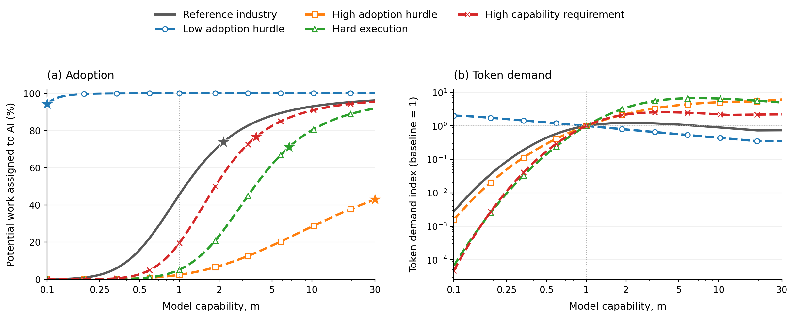
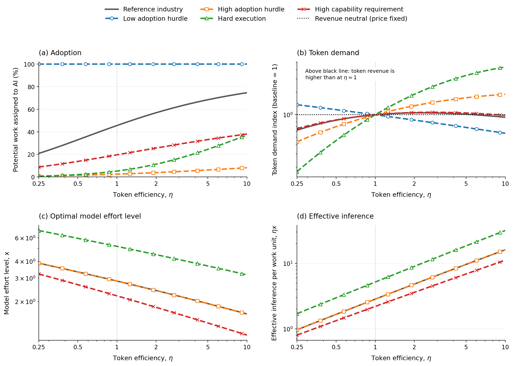
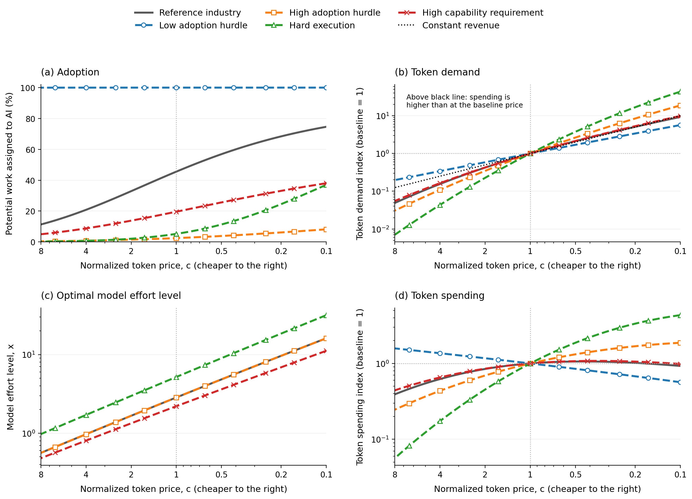
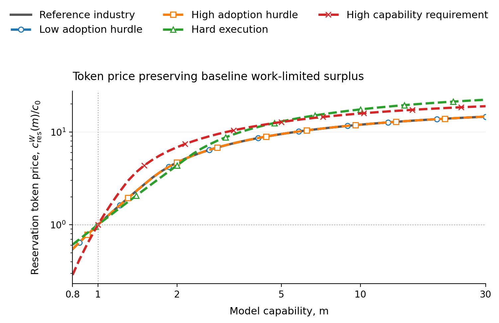
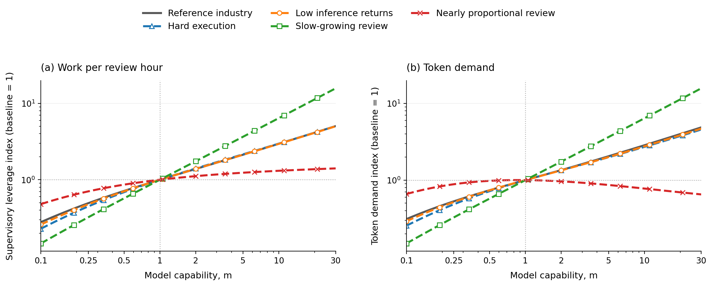
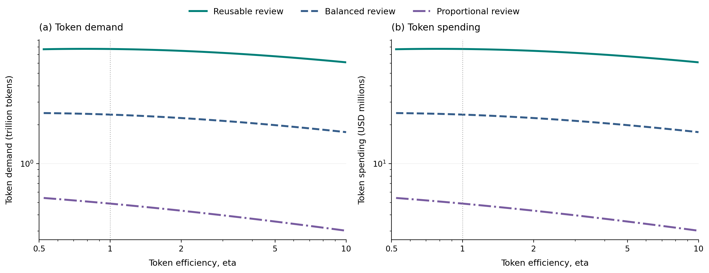
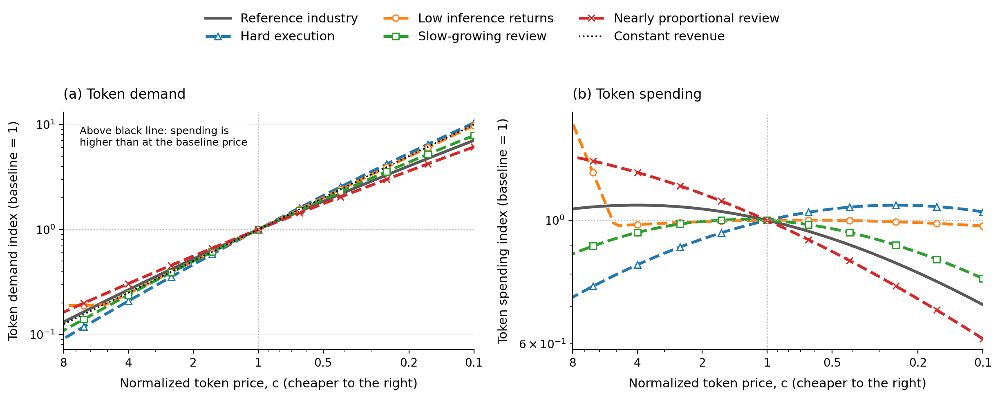
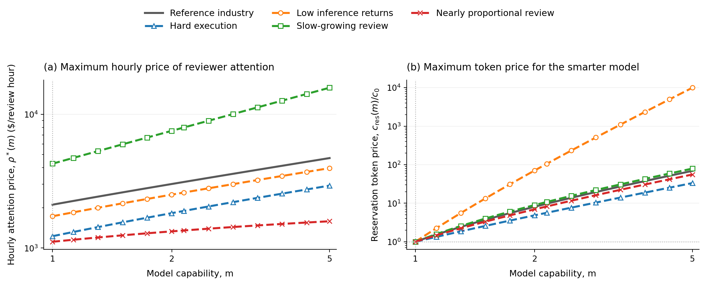

# Modeling Token Demand

## Introduction

Many discussions of AI token demand take a top-down approach: they start with an addressable market (for example, 100k annual salaries for 1 million software engineers = $100 billion TAM) and assume models capture some of it. This is a valid approach but does not illustrate the more nuanced dynamics at play.

We instead take a bottom-up approach, modeling users' adoption and usage as functions of model capability, price, and the effort required to verify AI outputs. This lets us isolate the market forces at play.

We compare two limiting regimes. In the work-limited regime, token demand is ultimately capped by the amount of work available. In the attention-limited regime, valuable work is abundant, but human review and verification constrain demand.

In the process, we identify cheap scalable human verification as a key lever to increase total token demand. If models can handle larger tasks while keeping verification time growth in check, then each human reviewer can oversee progressively more AI outputs. Under stylized assumptions, this effect can support unbounded token-demand growth as capability improves.

### TL;DR

- [When work is limited, total token demand can increase and then **decrease** as model capabilities improve.](#21-token-demand-peaks-as-adoption-nearly-saturates) Better models increase reliability and therefore uses fewer tokens for a given task; On the other hand better models also increase user surplus which increase adoption. Once adoption saturates, the token-saving effect dominates and overall token demand decreases.
- [Token efficiency can raise or lower token demand.](#22-token-efficiency-can-raise-demand-before-it-saves-tokens) Better token efficiency means fewer tokens required for tasks which raises surplus and adoption. Demand rises only when the increased adoption dominates the lower token usage per task.
- [Lower token prices always raise demand, but not necessarily revenue.](#23-cheaper-tokens-raise-demand-but-spending-eventually-falls) A Jevons paradox like effect requires demand to grow faster than price falls. This is easier when current adoption level is low and [harder when human attention is the bottleneck](#33-jevons-paradox-is-harder-to-reproduce-in-the-attention-limited-regime).
- [When human attention is scarce, capability creates value by raising supervisory leverage.](#31-capability-raises-demand-when-verification-cost-grows-slowly) Supervisory leverage is essentially the ratio between the task horizon that model is capable of, and the amount of human attention that is required to review and verify the AI's output.
- [With limited work, customers' willingness to pay eventually levels off.](#24-capability-raises-the-work-limited-reservation-token-price) Once AI can do almost all available work, further improvements in model capability add little value.
- [In the human-attention-limited regime, better model capability can **increase the value of human attention without bound.**](#34-capability-raises-the-value-of-scarce-attention) When useful task scope has no fixed ceiling and review time grows less than proportionally with scope, one person can oversee progressively more AI work.

## 1. Modeling assumptions

### 1.1 The user chooses scope and effort level

For each task, the user chooses two things:

- $s$: the scope of the task as measured in work units. A work unit can be thought of as the work a reference human completes in one hour. "Implement this function" would be a relatively small task, while "Refactor this entire system and ensure the test coverage is good" would be a large task.
- $x$: the model's normalized effort level per work unit; a task of scope $s$ consumes $sx$ token units. One can understand $x$ as the effort levels in major AI products: "low," "medium," "high," and so on. Specialized harnesses and agent loops can also be modeled through $x$. To prevent degenerate results, we normalize minimum viable effort to $x=1$. Another positive normalization would preserve the qualitative mechanisms, but it would rescale long-run demand levels and the reservation-price ceilings derived below.

After each attempt, the user verifies the output. Larger assignments are less reliable and take longer to review, but they require fewer review checkpoints. Tab completion illustrates one extreme: tiny, reliable suggestions with many checkpoints. Delegating an entire project illustrates the other: few checkpoints, but lower reliability and more review per checkpoint.

For more difficult tasks, higher $x$ can significantly increase the success probability. For easy tasks, however, a large $x$ unnecessarily increases token usage without meaningfully improving the quality of the output.

The user chooses the optimal $s$ and $x$ to maximize utility, as made explicit below.

### 1.2 Model capability expands the set of feasible tasks

Let $m$ denote model capability. The share of tasks within the model's capability frontier is given by

```math
q(s;m)=\exp\left[-\left(\frac{s}{\lambda m}\right)^\nu\right],
```

where the parameters $\lambda$ and $\nu$ together define how *difficult* the set of possible tasks is. Different industries have different $\lambda$ and $\nu$. Given a fixed model capability $m$ and task scope $s$, $q(s;m)$ is the fraction of work in the industry that is feasible for the model.

Note that feasibility does not imply a 100% success rate, which we model next.

### 1.3 More tokens spent = higher probability of success

Conditional on a task being feasible, we model the probability of successful execution as

```math
r(s,x;m,\eta)
=\exp\left[-\frac{s}{a m(\eta x)^\alpha}\right].
```

The parameter $\alpha\in(0,1)$ determines diminishing returns to inference. $\eta$ measures token efficiency: doubling $\eta$ achieves the same reliability with half as many tokens. We separate efficiency from capability because capability expands the feasible task set, whereas efficiency shifts the reward-versus-tokens curve toward fewer tokens.

Combined with the task feasibility set, a model can successfully complete a task with scope $s$ with probability

```math
P(s,x;m,\eta)=q(s;m)r(s,x;m,\eta).
```

### 1.4 Human reviews take longer as tasks get larger

We model the review time for one task as

```math
h(s)=h_0+h_1\left[(1+s)^\beta-1\right].
```

$h_0$ is the fixed time associated with one review. The second term grows with assignment size. Depending on the type of workflow, $\beta$ can be small, which means that human verification time grows slowly with task horizon $s$. When $\beta$ is close to one, review grows almost in proportion to the work delegated. As $\beta$ approaches 0, review time approaches $h_0$; as $\beta$ approaches 1, it approaches $h_0+h_1s$. For very small $s$, however, the variable term is approximately $h_1\beta s$ for every $\beta$; the $s^\beta$ behavior used later is a large-scope approximation.


Examples of workflows with small $\beta$ include software engineering work with automated tests and reliable benchmarks. Examples with large $\beta$ include insurance claims and legal cases, where each case still requires human supervision and the amount of human verification work grows nearly linearly with the task scope. 

Let $w$ be the dollar value of one hour of human attention. Review cost per unit of work is

```math
w\frac{h(s)}s.
```

### 1.5 The user maximizes expected surplus

Let $b$ be the value of one successfully completed work unit. Let $c$ be the dollar price of one normalized token unit. Expected surplus per assigned work unit is

```math
u(s,x)=bP(s,x;m,\eta)-cx-w\frac{h(s)}s.
```

Given a fixed set of model and industry parameters, let $s^*$ and $x^*$ be the scope and model-effort settings that maximize the user's surplus per work unit.

### 1.6 Adoption depends on the value of using AI

A positive optimized surplus, $u^*:=u(s^*,x^*)>0$, does not by itself guarantee that a user will adopt AI. Completing the work manually may generate even more surplus, or adoption may face organizational frictions. Conversely, some users may adopt even when measured surplus is negative because they value being AI-forward or have a mandate to use AI. We capture these considerations with an adoption hurdle $\phi$, which can be positive or negative and is distributed logistically across work units. A user adopts when surplus exceeds this hurdle. The fraction of work that adopts AI at a given surplus is then

```math
A(u)=\Pr(\phi\leq u)=\frac{1}{1+\exp[-(u-\mu)/\sigma]}.
```

The location $\mu$ sets the typical hurdle. The spread $\sigma$ determines whether adoption is gradual or concentrated around a threshold.

Heterogeneity enters only through $\phi$. Conditional on adoption, all work units share the same value and technical parameters and use the same optimized policy $(s^*,x^*)$; changes in task mix are outside the model.

### 1.7 Token spending equals provider revenue

Let $Q$ be the number of work units assigned to AI during the period. Then

```math
D=Qx
```

is **token demand**, measured in normalized token units. **Token spending** is demand times unit price

```math
R=cD,
```

measured in dollars. In this model, users' token spending is the model provider's token revenue.

In the next two sections we will study the different adoption and demand curves as a function of model capability, token efficiency, and token price in two distinct regimes.

The model parameters are summarized below.

<details class="parameter-reference">
<summary>Model notation reference (19 quantities)</summary>

| Parameter | Name | Category | How it is used in the model |
|---|---|---|---|
| $s$ | Delegated scope | User action | Work units assigned before the next review. It enters feasibility $q(s;m)$, execution reliability $r(s,x;m,\eta)$, and review time $h(s)$. |
| $x$ | Model effort level | User action | Normalized token units used per work unit, with minimum viable effort $x=1$. Effective inference is $\eta x$, token cost per work unit is $cx$, and one assignment uses $sx$ token units. |
| $m$ | Model capability | Model parameter | Expands both the capability horizon $\lambda m$ in $q(s;m)$ and the execution horizon in $r(s,x;m,\eta)$. |
| $\eta$ | Token efficiency | Model parameter | Converts token units into effective inference, $\eta x$, in the execution-reliability function. |
| $c$ | Token price | Model parameter | Dollar price of one normalized token unit. It determines token cost $cx$ and total token spending $R=cD$. |
| $\lambda$ | Capability horizon | Industry parameter | Sets the baseline assignment scope the model can feasibly handle in $q(s;m)=\exp[-(s/(\lambda m))^\nu]$. |
| $\nu$ | Capability shape | Industry parameter | Controls how sharply the feasible share falls as delegated scope grows in $q(s;m)$. |
| $a$ | Execution ease | Industry parameter | Scales the execution horizon $am(\eta x)^\alpha$ in $r(s,x;m,\eta)$. |
| $\alpha$ | Inference returns | Industry parameter | Controls the diminishing return from effective inference $\eta x$ in the execution horizon. |
| $h_0$ | Fixed review time | Industry parameter | Captures the fixed time required to open, understand, and close a review in $h(s)=h_0+h_1[(1+s)^\beta-1]$. |
| $h_1$ | Variable review scale | Industry parameter | Scales the part of human verification time that grows with delegated scope in $h(s)$. |
| $\beta$ | Review elasticity | Industry parameter | Controls the curvature of the shifted-power term in review time; $h(s)$ behaves like $s^\beta$ only at large scope. |
| $b$ | Value of successful work | Industry parameter | Dollar value of one successfully completed work unit. Expected benefit per assigned work unit is $bP(s,x;m,\eta)$. |
| $w$ | Value of human attention | Industry parameter | Dollar value of one hour of human review. Review cost per assigned work unit is $wh(s)/s$. |
| $\phi$ | Adoption hurdle | Work-level heterogeneity | Random hurdle that optimized surplus must exceed for adoption. It can be positive or negative. |
| $\mu$ | Hurdle location | Industry parameter | Sets the location of the logistic distribution of adoption hurdles in $A(u)$. |
| $\sigma$ | Hurdle spread | Industry parameter | Controls whether adoption is gradual or concentrated around the hurdle location in $A(u)$. |
| $W$ | Potential work | Industry parameter | Total work available in the work-limited regime, where assigned work is $Q=WA$. |
| $H$ | Human attention | Industry parameter | Review hours available in the attention-limited regime, where assigned work is $Q=Hs/h(s)$. |

</details>


## 2. Work is limited

In this regime, there are only $W$ potential work units. Better or cheaper AI can increase token demand by increasing user surplus and bringing more work over the adoption threshold.

We start with a reference industry and vary one parameter at a time to produce stylized, not quantitatively calibrated, industries. We then vary model capability, token efficiency, and token price and study how adoption, demand, and spending change. Every line uses $W=1{,}000{,}000$.

| Plot line | $\lambda$ | $\nu$ | $a$ | $\alpha$ | $h_0$ | $h_1$ | $\beta$ | $b$ | $w$ | $\mu$ | $\sigma$ |
|---|---:|---:|---:|---:|---:|---:|---:|---:|---:|---:|---:|
| Reference industry | 12 | 1.25 | 4 | 0.5 | 0.03 | 0.05 | 0.5 | 100 | 100 | 81 | 4 |
| Low adoption hurdle | 12 | 1.25 | 4 | 0.5 | 0.03 | 0.05 | 0.5 | 100 | 100 | **40** | 4 |
| High adoption hurdle | 12 | 1.25 | 4 | 0.5 | 0.03 | 0.05 | 0.5 | 100 | 100 | **95** | 4 |
| Hard execution | 12 | 1.25 | **1** | 0.5 | 0.03 | 0.05 | 0.5 | 100 | 100 | 81 | 4 |
| High capability requirement | **3** | 1.25 | 4 | 0.5 | 0.03 | 0.05 | 0.5 | 100 | 100 | 81 | 4 |


### 2.1 Token demand peaks as adoption nearly saturates



*Each demand curve is normalized to 1 at $m=1$ to show its trend rather than its absolute level. A star on each adoption curve marks the plotted value of $m$ where the corresponding token-demand curve is highest; this includes endpoints rather than implying an interior peak.*

Higher capability raises reliability and adoption but reduces tokens per task. In industries with already high adoption, the token-saving effect dominates and demand decreases as models improve. Figure 1(a) marks the capability at which each plotted demand curve is highest.

The accounting gives a simple bound that does not depend on the logistic adoption curve. Since $D=WAx$ and $A\leq1$, suppose effort eventually falls to a fraction $r$ of its baseline value. Even if adoption then reached 100%, demand must fall below baseline whenever baseline adoption exceeds $r$:

```math
\frac{D_{\rm later}}{D_1}\leq\frac{r}{A_1}<1
\quad\text{if}\quad A_1>r.
```

In the reference case, $A_1=0.455$ and the effort floor reduces $x^*$ from 2.85 to 1, so $r=0.35$ and later demand is at most 77% of baseline; the numerical curve is at 74% by $m=30$. The bound highlights the mechanism, while the precise long-run level also depends on the adoption distribution and on the $x\geq1$ normalization.


### 2.2 Token efficiency can raise demand before it saves tokens



*A value of $\eta=2$ means that each token provides twice as much effective inference as at $\eta=1$. Panel (b) normalizes each demand curve to 1 at $\eta=1$ to show its trend rather than its absolute level; the black horizontal line marks unchanged token revenue because token price is fixed. Panels (c) and (d) report the model effort level $x$ and effective inference $\eta x$. The three hurdle-only cases overlap in these panels because adoption hurdles do not change the optimal policy conditional on use.*

There is an exact link between efficiency and price. Away from the effort floor, reliability depends on effective inference $z=\eta x$, while token cost is $(c/\eta)z$. In either regime this implies

```math
R(\eta,c)=R(1,c/\eta),
\qquad
D(\eta,c)=\frac{1}{\eta}D(1,c/\eta).
```

An efficiency improvement therefore poses the same optimization problem as a proportional price cut, but uses $1/\eta$ as many tokens to obtain the same effective inference. This is why the demand index in Figure 2(b) equals the spending index in Figure 3(d) evaluated at $c=1/\eta$. The identity can fail once the minimum effort $x=1$ binds.

Economically, higher efficiency leaves users with more surplus and can increase adoption, but it also reduces tokens per task. The adoption effect dominates in the high-hurdle and hard-execution cases over much of the plotted range. In settings where efficiency cannot unlock enough additional adoption, token demand eventually falls.

### 2.3 Cheaper tokens raise demand, but spending eventually falls



*Price falls from left to right. Panel (a) reports adoption in levels. Panels (b) and (d) normalize every curve to 1 at $c=1$ to show its trend rather than its absolute level. Panel (c) reports the optimal model effort level $x$ in levels. The black line in panel (b) is the demand increase required to keep spending unchanged.*

Unlike an increase in token efficiency, a lower token price induces users to choose more tokens per task (Figure 3(c) versus Figure 2(c)). Demand therefore rises in every plotted industry, including those with high adoption. Spending rises only if the demand response is proportionally larger than the price cut.

The model makes that Jevons threshold precise. Let $\varepsilon_x=d\ln x^*/d\ln c<0$ be the local price elasticity of optimized effort. The envelope theorem gives $du^*/dc=-x^*$, and the logistic adoption curve then gives $d\ln A/d\ln c=-(1-A)cx^*/\sigma$. Since $R=cWAx^*$, spending rises as price falls exactly when

```math
\underbrace{(1-A)\frac{cx^*}{\sigma}}_{\text{adoption response}}
+\underbrace{|\varepsilon_x|}_{\text{effort response}}>1.
```

The first term is large when much work remains unadopted, token spending per work unit is high, or adoption hurdles are tightly concentrated. The second captures users moving to higher effort as tokens get cheaper. Together they must exceed one to offset a 1% price decline. In the reference industry at $c=1$, the two terms are 0.39 and 0.77, so a small price cut raises spending locally; as adoption saturates, the first term shrinks and further price cuts eventually reduce spending.

### 2.4 Capability raises the work-limited reservation token price
So far token price has been exogenous. To study provider pricing power, let optimized surplus per assigned work unit be $u^*(m,c)$. We define the work-limited reservation token price of a more capable model by

```math
u^*\!\left(m,c_{\rm res}^{W}(m)\right)=u^*(1,c_0).
```

It is the highest price that preserves baseline optimized surplus and therefore adoption $A(u^*)$, after reoptimizing $s$ and $x$. The superscript $W$ distinguishes it from the attention-limited price below.



*The vertical axis reports $c_{\rm res}^{W}(m)/c_0$ on a logarithmic scale. The adoption-hurdle-only cases coincide with the reference because the hurdle does not enter $u^*$; we retain them to make that invariance visible, with staggered markers in the static figure and separate toggles in the interactive figure. The user reoptimizes $s$ and $x$ at every point.*

We start with a model at capability $m=1$ and price $c_0$. At $m=0.8$, preserving baseline surplus requires a price of $0.29c_0$ to $0.61c_0$: the user demands a discount for a less capable model. At $m=30$, the reservation price reaches $14.6c_0$ in the reference, $18.9c_0$ under high capability requirements, and $22.2c_0$ under hard execution.

The reservation price approaches a finite ceiling rather than increasing forever. With $x_{\min}=1$ and $\beta<1$, sufficiently capable models approach perfect reliability while review cost per work unit vanishes, so

```math
c_{\rm res}^{W}(\infty)=b-u^*(1,c_0).
```

This ceiling is 19.7 in the reference and 30.6 under hard execution. The result is conditional on the effort-floor normalization: once effort cannot fall further, additional capability cannot support an ever-higher price per token.


In summary, capability and efficiency can eventually reduce token demand once adoption gains no longer offset token savings (Figures 1 and 2). Lower prices raise spending only where adoption and effort respond strongly enough (Figure 3), and even complete extraction of incremental user surplus faces a finite work-limited reservation-price ceiling (Figure 4).

## 3. Human attention is limited

In this regime, worthwhile work is abundant but only $H$ human review hours are available. If $n$ tasks use policy $(s,x)$, the attention constraint is

```math
n h(s)\leq H.
```

We define **supervisory leverage** as

```math
\ell(s)=\frac{s}{h(s)},
```

the work assigned to AI per human review hour. Once all $H$ hours are used, $n=H/h(s)$ and total assigned work is $Q=ns=H\ell(s)$. 

With this attention constraint, the user chooses $(n,s,x)$ to maximize

```math
ns\left[bP(s,x;m,\eta)-cx\right]-wnh(s)
\quad\text{subject to}\quad nh(s)\leq H.
```

Conditional on the objective being greater than 0, the constraint is binding, so we can substitute $n=H/h(s)$, which makes total surplus

```math
\Pi(s,x)=H\underbrace{\left\{\frac{s}{h(s)}\left[bP(s,x;m,\eta)-cx\right]-w\right\}}_{J(s,x)}.
```

$J(s,x)$ is expected surplus per review hour. Since $H>0$ is fixed, maximizing total surplus subject to the attention constraint is equivalent to maximizing $J(s,x)$.

The work- and attention-limited cases are polar regimes of the same resource accounting. At a work-limited policy, required review time is $WA\,h(s^*)/s^*$; attention becomes the relevant bottleneck when that requirement exceeds $H$.

These figures use $H=100{,}000$ review hours. Again, every alternative industry changes exactly one parameter from the reference and the difference is marked in bold.

| Plot line | $\lambda$ | $\nu$ | $a$ | $\alpha$ | $h_0$ | $h_1$ | $\beta$ | $b$ | $w$ | $\mu$ | $\sigma$ |
|---|---:|---:|---:|---:|---:|---:|---:|---:|---:|---:|---:|
| Reference industry | 12 | 1.25 | 4 | 0.5 | 0.03 | 0.05 | 0.5 | 100 | 100 | 81 | 4 |
| Hard execution | 12 | 1.25 | **1** | 0.5 | 0.03 | 0.05 | 0.5 | 100 | 100 | 81 | 4 |
| Low inference returns | 12 | 1.25 | 4 | **0.2** | 0.03 | 0.05 | 0.5 | 100 | 100 | 81 | 4 |
| Slow-growing review | 12 | 1.25 | 4 | 0.5 | 0.03 | 0.05 | **0.15** | 100 | 100 | 81 | 4 |
| Nearly proportional review | 12 | 1.25 | 4 | 0.5 | 0.03 | 0.05 | **0.95** | 100 | 100 | 81 | 4 |

The slow-growing-review case represents workflows where automated tests, benchmarks, or standardized checks keep verification time from growing quickly with task horizon $s$. The low-inference-returns case represents workflows where additional inference has sharply diminishing value.

### 3.1 Capability raises demand when verification cost grows slowly



*Both outcomes are normalized to 1 at $m=1$ to show their trends rather than their absolute levels. Price is fixed, so spending has the same shape as demand.*

A better model uses fewer tokens for a given task, but can also handle larger tasks. In the reference, hard-execution, low-inference-returns, and slow-growing-review industries, work supervised per review hour expands enough that token demand rises. The increase is especially strong when $\beta$ is small, because review time grows slowly relative to task scope. The user can therefore assign longer and more valuable tasks without a proportional increase in verification time. When $\beta=0.95$, human verification time grows nearly in proportion to task horizon. Supervisory leverage then expands too slowly to keep offsetting token savings from smarter models, so demand peaks and falls.

### 3.2 Token efficiency can expand work per review hour



*Both outcomes are normalized to 1 at $\eta=1$ to show their trends rather than their absolute levels. Capability, review hours, and token price are fixed.*

Efficiency does not create more review hours, but it can change the size of the task the user sends to the model. In the reference, slow-growing-review, and nearly proportional-review industries, that expansion is too small to offset fewer tokens per work unit, so demand falls over most of the range. When execution is hard, greater efficiency makes larger assignments worthwhile and demand rises. When returns to inference are low, those forces nearly cancel and demand stays almost flat. These are intensive-margin responses: all review hours were already in use, but each hour can support a different amount of work.

Compared with the work-limited regime, token efficiency is a weaker lever for generating additional token revenue when human attention is scarce.

### 3.3 Jevons paradox is harder to reproduce in the attention limited regime



*Price falls from left to right. Every curve is normalized to 1 at $c=1$ to show its trend rather than its absolute level. The black line is the demand increase required to keep spending unchanged.*

In this regime, all $H$ review hours are used, and token demand is $D=H[s/h(s)]x$. When tokens get cheaper, the user chooses a higher effort level $x$. The extra inference can also make larger assignments $s$ worthwhile, which may increase the work assigned per review hour, $s/h(s)$. Demand therefore grows through both more tokens per unit of work and more work per scarce review hour. Token revenue rises only if this combined increase in demand is larger than the inverse price decline shown in Figure 7a.

These forces are strongest when execution is hard: extra inference meaningfully improves success and supports larger assignments, so demand rises faster than price falls. In most other cases, demand does not grow enough to offset the lower price. The work-limited Jevons condition above has an adoption term; here it does not. Spending can rise only if the combined price response of optimized effort and supervisory leverage exceeds one. Put differently, a price cut can bring new work into the market when work is limited, whereas an attention-limited user can respond only by changing how each already-scarce review hour is used.

### 3.4 Capability raises the value of scarce attention

Figures 5–7 study token demand and revenue. We now ask how capability changes user surplus and the value of an additional review hour. This is a measure of labor demand, not a wage forecast: the model holds $H$ fixed and omits labor supply.

At token price $c$, we define optimized user surplus per review hour (i.e. the value of reviewer attention) as

```math
J^*(m,c)=\max_{s,x}\left\{\frac{s}{h(s)}\left[bP(s,x;m,\eta)-cx\right]-w\right\},
\qquad
\rho^*(m,c)=J^*(m,c)+w.
```

$J^*(m,c)$ is net surplus after token spending and the opportunity cost $w$ of review. Adding $w$ back gives $\rho^*(m,c)$, the value created by one review hour after token spending, or the maximum hourly review price consistent with operating. Panel (a) evaluates it at $c_0=1$.

The model provider may instead capture some of this value through the token price. Starting from a baseline model with capability $m=1$ and price $c_0$, define the attention-limited reservation token price $c_{\mathrm{res}}^{H}(m)$ by

```math
J^*\!\left(m,c_{\mathrm{res}}^{H}(m)\right)=J^*(1,c_0).
```

This is the highest token price that preserves baseline optimized surplus after reoptimizing $s$ and $x$. It is an upper bound on willingness to pay for capability, not a predicted market price.



*Panel (a) normalizes each $\rho^*(m,c_0)$ curve by that same line's value at $m=1$, so every line equals 1 at the baseline capability. Panel (b) reports the fully reoptimized $c_{\rm res}^{H}(m)/c_0$, which also equals 1 at $m=1$. Both vertical axes are logarithmic, $\eta=1$, and $m$ ranges from $0.8$ to $30$.*

At $m=30$, the value of a review hour is 5.3 times its baseline in the reference industry and 15.8 times its baseline with slow-growing review, compared with only 1.8 times its baseline when review time grows nearly in proportion to task scope. The difference comes from supervisory leverage: larger tasks create much more work per review hour when $\beta$ is small, but much less when $\beta$ is close to one. In a model that allowed hiring, this rising value would create an incentive to expand review labor, illustrating complementarity between more capable models and human verification.

As a back-of-the-envelope calculation, success depends on the ratio $s/m$, so keeping reliability roughly constant allows task scope to grow in proportion to capability, $s\propto m$. At large task scope, review time is approximately $h(s)\approx h_1s^\beta$. The total value created by one hour of human review after token cost is therefore roughly

```math
\rho^*(m,c_0)\propto \frac{s}{h(s)}\propto m^{1-\beta}.
```

This means approximately $m^{0.5}$ growth in the reference industry, $m^{0.85}$ with slow-growing review, and only $m^{0.05}$ with nearly proportional review. At exactly $\beta=1$, $s/h(s)$ instead approaches $1/h_1$, and the value of attention approaches the finite ceiling $(b-c_0)/h_1$.

The reservation token price follows the same intuition. At $m=0.8$, a less capable model requires a discount, with $c_{\rm res}^{H}$ ranging from $0.20c_0$ to $0.57c_0$. By $m=30$, a more capable model supports prices between $39.4c_0$ and $70.7c_0$ while preserving baseline user surplus. With $\beta<1$ and the effort floor $x=1$, the reservation price converges to $b$: each work unit creates at most $b$ in expected value and consumes at least one token. This limits the price per token, but not the value of scarce attention. When review time grows less than proportionally with task scope, a more capable model can continue increasing $s/h(s)$, so the same human hour supports more work even after token use per work unit reaches its minimum. This is the key difference from the work-limited regime, where the total amount of available work is fixed.

## 4. Conclusion

We studied how model capability, token efficiency, and token prices affect token demand and revenue under two limiting resource constraints: finite work and finite human attention. When work is limited, capability and efficiency raise adoption but reduce token use per task. As adoption saturates, token demand can peak and eventually fall. Similarly, lower token prices increase demand but raise revenue only when they unlock enough additional adoption. The work-limited reservation token price eventually plateaus because total work is fixed and inference effort cannot fall below its minimum.

When human attention is limited, the key limiting factor is the amount of work supported by each review hour. More capable models can make larger assignments worthwhile, so token demand and the value of reviewer attention can continue to grow even as token use per unit of work falls. This effect is strongest when review time grows slowly with task scope. At large scope, if review time grows approximately as $s^\beta$, the value of attention grows roughly as $m^{1-\beta}$. The reservation token price also has a per-token ceiling, even when the value of scarce attention continues to rise.

Taken together, our results show that technical progress alone does not determine token demand or revenue. The outcome depends on which resource is scarce, how much adoption remains to be unlocked, and crucially how verification costs scale with task scope. An interesting avenue for future work is to study how the pricing dynamics change when there are multiple competing model providers.
