# When does better AI increase token demand?

*Adoption, delegated scope, and scarce human attention*

**Working paper · August 2026**

## Abstract

Better AI can complete more work while using fewer tokens. Whether total demand rises depends on how much additional work becomes worth doing and how much people can supervise. We model users who choose the scope of a delegated task and its inference budget. Every task consumes tokens and review time, including failures. With a finite workload, demand expands through adoption; with abundant work, it expands through work supervised per hour. Three results organize the analysis. A price cut weakly increases token purchases, but increases spending only when demand is sufficiently elastic. An efficiency improvement changes token purchases by exactly the same proportion as an equivalent price cut changes spending. Faster verification expands demand in proportion to the capacity it releases when attention binds. Capability gains can instead produce rising or falling demand as adoption, supervision, and inference savings interact. The numerical examples illustrate these mechanisms; they are not estimates of particular industries or forecasts of aggregate spending.

## 1. The economic question

Suppose a team uses AI to prepare a fixed set of monthly reports. A better model might produce the same reports with half as many tokens. If most reports already use AI, token purchases could fall. Now suppose a research team has a long list of worthwhile candidate designs but little time to check them. A better model might let each reviewer handle larger assignments, expanding the amount of work attempted. Token purchases could rise even if each work unit needs fewer tokens.

The distinction is not the occupation. It is what limits activity: the amount of worthwhile work, or the attention available to supervise it. Either team can move from one situation to the other.

The accounting is simple:

```math
\text{Token demand}
=\text{work assigned to AI}\times\text{tokens per work unit}.
```

The economics determines both factors. Higher capability can bring work into use, permit longer assignments, or save inference on existing work. Lower prices encourage extra inference. Greater efficiency supplies the same effective computation with fewer tokens. None of these responses is captured by assigning AI a fixed share of the value of the work it touches.

We develop three conclusions. **Price experiments can diagnose efficiency rebound:** under a precise efficiency assumption, the spending response to cheaper tokens reveals whether more efficient tokens increase or decrease total token use. **Adoption headroom and review technology distinguish demand regimes:** a gain that expands one workflow can save tokens in another. **Verification can expand the usable market:** when review hours bind, reducing review time lets users apply AI to more work, without any increase in model accuracy.

The argument starts with user choices and the two constraints. We then study price and efficiency, capability, and verification, in that order. Four figures show the mechanisms. Functional forms, proofs, parameter comparisons, and additional experiments are in the appendices.

## 2. A model of delegated work

### 2.1 Two choices and one review

A work unit is the amount of useful work a reference human would perform in an hour. This is a unit of task scope, not the AI's running time. A user chooses:

- **Scope $s$:** work delegated before the next review.
- **Inference intensity $x$:** tokens spent per work unit.

A chunk therefore uses $sx$ tokens. Larger scope amortizes checkpoints over more work but makes successful completion harder. More inference improves execution at a cost. Both choices are needed: fixing scope removes the supervision response, while fixing inference intensity removes token savings.

Let $P(s,\eta x;m)$ be the probability that a chunk succeeds. Capability $m$ improves success at a given policy; efficiency $\eta$ provides more effective inference per token. Success falls with scope and rises with effective inference. Review takes $h(s;v)$ human hours, where a lower $v$ makes review uniformly faster. For now, no particular formula for either function is needed.

Every chunk is attempted once and reviewed once. A successful chunk produces $s$ units of completed work; a failed chunk produces none during the modeled period. Both consume the full token budget and review time. With output value $b$ per completed work unit, token price $c$, and review-hour opportunity cost $w$, expected surplus per assigned work unit is

```math
u(s,x)=bP(s,\eta x;m)-cx-w\frac{h(s;v)}s.
```

Failure is costly under either constraint. It uses paid inference and human attention without creating output. No extra failure penalty is required to make reliability matter.

This formulation describes work that can be checked after an attempt. Review identifies success, its duration depends on scope rather than the outcome or the raw token count, and the user cannot identify infeasible chunks for free before assignment. Partial completion, repair, and undetected damage are excluded. These choices keep the mechanism small; they also limit the settings to which it applies.

### 2.2 What is scarce?

**Limited work.** There are $W$ potential work units, and review time can be obtained at cost $w$. Work opportunities differ in their outside options and switching hurdles. A work unit adopts AI if optimized surplus $u^*=\max_{s,x}u(s,x)$ exceeds its nonnegative hurdle $\phi$. Let $A=F(u^*)$ be the work-weighted adopted share.

Hurdles do not depend on the policy. Each opportunity therefore prefers the same $(s,x)$ before deciding whether to adopt. This assumption separates adoption from policy choice; it does not model users selecting progressively harder tasks. The main results require only a nondecreasing hurdle distribution. The numerical distribution is specified in Appendix A.

**Limited attention.** Useful work is abundant, but the user has only $H$ review hours. A policy launches $s/h(s)$ work units per review hour. Define this quantity as $L(s)$, or work supervised per hour. Conditional on operating, the user maximizes

```math
J(s,x)=L(s)[bP(s,\eta x;m)-cx]-w
      =L(s)u(s,x).
```

This is expected surplus per scarce review hour. If $\max J\leq0$, the user can choose not to operate; all plotted attention cases have positive operating value. Abundant work means there are enough opportunities at the modeled value and negligible additional switching hurdles to fill capacity.

The two objectives select different policies because an hour spent on one assignment can crowd out other useful work when attention binds.

| | Limited work | Limited attention |
|---|---|---|
| Policy maximizes | Surplus per work unit, $u$ | Surplus per review hour, $J$ |
| Work assigned, $Q$ | $WA$ | $HL$ |
| Token demand, $D=Qx$ | $WAx$ | $HLx$ |
| Expected completed work, $Y=QP$ | $WAP$ | $HLP$ |

Tokens and review hours are counted for all assigned work, including failures. Completed work is a separate outcome. Token spending, $S=cD$, is separate again: it is supplier revenue, not supplier profit or the economic value created.

We study these two limiting cases to expose the mechanisms. When both constraints matter, scarce review time changes the policy itself. Appendix A gives their common allocation foundation; applying an attention cap after choosing a work-optimal policy is generally insufficient.

## 3. Cheaper tokens, more efficient tokens

### 3.1 A price cut raises purchases, but need not raise spending

A lower token price makes additional inference worthwhile and raises the value of using AI. In the work-limited regime, chosen inference intensity and adoption both weakly increase. With attention limited, users weakly increase the tokens they buy per review hour. Thus a pure price cut cannot reduce optimized token quantity in either regime. This follows from revealed preference, without assuming a particular demand curve.

Spending can nevertheless fall. Halving price raises spending only if token purchases more than double. For a small price change, the threshold is a price elasticity of one: the percentage increase in quantity must exceed the percentage reduction in price.

**Figure 1 asks where that expansion can come from.** The reference and concentrated-adoption cases share the same technology. They differ only in how closely work opportunities' switching hurdles are clustered. The early-saturation case has easier tasks and already assigns almost all work to AI at the baseline. All cases are illustrative.

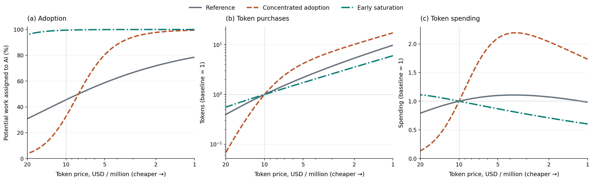

*Prices fall from left to right. Adoption is a share of potential work; purchases and spending are indexed to each case's own value at 10 dollars per million tokens. The purchase panel uses a logarithmic vertical scale. Every point reoptimizes scope and inference intensity.*

In the concentrated case, halving the baseline price moves adoption from roughly one-third to four-fifths. Token purchases rise about fourfold, so spending rises about twofold. Once most work has adopted, that source of expansion shrinks. Purchases can continue increasing while spending peaks and falls.

The lesson is conditional: a low price is especially effective at expanding the market when much work is near its adoption threshold. A large stock of potentially automatable work is not enough; its distance from that threshold matters.

### 3.2 A spending response identifies efficiency rebound

An efficiency gain is different from a price cut: it also reduces the raw tokens required for the same effective inference. But the two are linked exactly in this model.

Write effective inference as $z=\eta x$. A policy using $z$ costs $(c/\eta)z$ in tokens. Raising efficiency is therefore equivalent to lowering the price of effective inference, then dividing its use by the efficiency gain. Holding other inputs fixed,

```math
D(c,\eta)=\frac{D(c/\eta,1)}{\eta}.
```

This gives a particularly useful finite comparison. For an improvement by any factor $k>1$,

```math
\boxed{\frac{D(c,k\eta)}{D(c,\eta)}
=\frac{S(c/k,\eta)}{S(c,\eta)}}.
```

**Doubling efficiency changes token purchases by the same proportion as halving price changes token spending.** In the concentrated case above, a twofold efficiency gain therefore roughly doubles token use. In a case where halving price reduces spending, the same efficiency improvement reduces token use.

Equivalently, let $\epsilon$ be the positive price elasticity of token demand, evaluated at the corresponding effective price. Locally,

```math
\text{elasticity of token demand to efficiency}=\epsilon-1.
```

Efficiency produces more raw token use only when effective demand expands more than proportionately. That is the rebound threshold. The result does not require a logistic adoption curve or the success function used in our examples.

It does require efficiency to enter through $\eta x$, with no separate change in feasibility, review requirements, or available policy choices. A model release that changes all of these is not a pure efficiency experiment. Subject to that restriction, price variation can reveal the sign of rebound without separately estimating every technical parameter.

## 4. Capability: adoption or supervision?

Capability improves what a given inference budget can accomplish. The old policy remains available, so optimized surplus cannot fall. Token demand can fall because users change the policy. The relevant question is whether activity expands faster than tokens per work unit decline.

For any improvement, the accounting decomposes as

```math
d\log D=d\log Q+d\log x.
```

This identity is not itself a prediction. The resource constraint tells us which activity response to investigate.

### 4.1 Finite work: adoption eventually has less room to grow

With fixed $W$, assigned work is $Q=WA$. Demand rises when adoption growth outweighs any reduction in inference intensity. Once adoption is near its ceiling, additional capability has little work left to bring into use. Token savings can then dominate.

**Figure 2 shows both margins, not just their product.** In these examples, inference intensity falls throughout the displayed capability range while adoption rises. Their interaction produces a hump in demand.

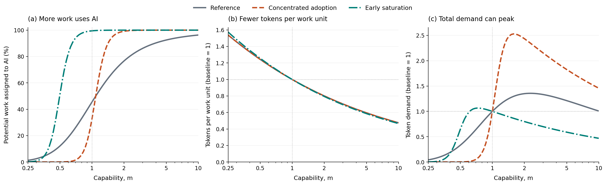

*The same three cases as Figure 1, with price, efficiency, and review technology fixed. Adoption is a percentage; the other panels use each case's own $m=1$ baseline. Reference and concentrated-adoption inference curves coincide because their technology and preferred policy are identical.*

The concentration comparison isolates the adoption mechanism: the same technical response produces a sharper demand increase when many opportunities switch together. Early saturation moves the peak earlier. Beyond its baseline, that case completes more work while using fewer tokens.

This is one reason a demand elasticity estimated during adoption takeoff may not persist. The adoption distribution is unchanged in the experiment; the user moves through it. The same workflow can respond differently after most of its work has switched.

Neither an adoption plateau nor a capability score alone establishes a ceiling on token use. Users can still adjust inference, the workload can grow, and other workflows can enter. The plotted humps demonstrate a mechanism under fixed work, not an aggregate forecast.

### 4.2 Abundant work: review determines how far activity can expand

With fixed attention, assigned work is $Q=HL$. Larger chunks can increase $L=s/h(s)$ if review takes less than proportionately more time. If reviewing twice as much work takes almost twice as long, increasing scope releases little capacity.

**Figure 3 compares those two review technologies.** It uses cases from the same parameter set, but adoption no longer constrains activity. The question is whether growth in work supervised per hour offsets inference savings.

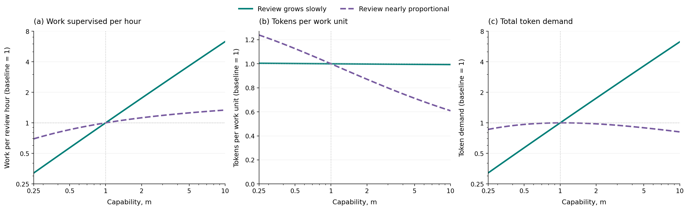

*Attention is fixed and useful work is abundant. Every series uses its own $m=1$ baseline. The first and third panels use logarithmic vertical scales. The cases have the same technical success function; their review technologies differ. Review levels scale demand, while the growth of review time with scope drives these indexed responses.*

When review grows slowly, the reviewer can supervise much more work and token demand rises strongly. With nearly proportional review, that expansion is modest. Inference savings eventually outweigh it, and token demand falls even though completed work and optimized value rise in this example.

The local object to measure is $\theta=d\log h/d\log s$, the percentage increase in review time associated with a one-percent increase in scope. An increase in scope raises work supervised per hour by $(1-\theta)$ times as much, in percentage terms. A long delegation horizon is economically useful only to the extent that it expands this ratio.

There is a simple benchmark. With no fixed checkpoint overhead, sublinear power-law review, and the horizon-scaling capability used in the examples, optimal scope scales with capability and inference intensity stays constant. Demand then grows as $m^{1-\beta}$, where $\beta<1$ is review's scope elasticity. Fixed overhead allows the balance to change along the path, including the additional valley example in Appendix B.

Under this horizon-scaling capability assumption, interior choices also connect review to economic value: the capability elasticity of an additional review hour's optimized value, before charging for that hour, is $1-\theta$. This is a value result, not a token-volume result. It makes clear why scarce attention does not by itself guarantee rapid growth in either inference purchases or the value of supervision. The review technology matters.

## 5. Verification expands the usable market

A faster model does not necessarily make its output faster to check. We therefore treat review technology as a separate margin. **Figure 4 asks what happens when every review takes less time**, holding capability, token efficiency, and price fixed.

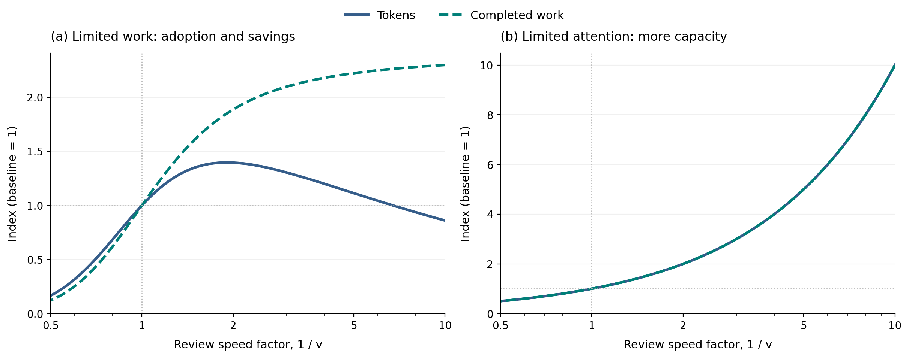

*A review speed factor of two means half the review time at every scope. Tokens and completed work are indexed to the reference case's own baseline in each regime. In the attention panel the two curves coincide. Available work is fixed only in the left panel.*

Under binding attention, write $h(s;v)=v h(s;1)$. Lowering $v$ multiplies the value of every policy per review hour by the same factor, before the fixed hourly charge. It leaves the preferred scope, inference intensity, and success probability unchanged. If useful work remains abundant,

```math
D^H(v)=\frac{D^H(1)}v,\qquad
Y^H(v)=\frac{Y^H(1)}v.
```

Halving review time doubles token demand and completed work. This result comes from releasing capacity; it does not require improved success.

With a finite workload, faster review instead changes policy and adoption. In the reference example, halving review time nearly doubles completed work but raises token use by only about 40%. Larger speed gains eventually reduce token demand as adoption saturates and users save inference. Faster verification can therefore be complementary to aggregate token use in one regime and lead to net token savings in another.

The proportional attention result stops applying when the extra capacity runs out of worthwhile work. A lower wage also has a different effect from faster review: it changes the monetary cost of operating, but does not create additional review hours. Conditional on activity in the attention-limited regime, $w$ affects participation rather than the optimal policy.

Changing how review grows with scope is another distinct intervention. It changes which policy is best, rather than multiplying the capacity of every policy equally. Appendix B examines that case and explains why lowering a review-growth exponent is not a uniform improvement for every task size.

## 6. Industry regimes and what to measure

The model suggests classifying workflows by observable constraints rather than assigning an elasticity to an occupation.

| Workflow conditions | Margin to measure | Conditional demand implication |
|---|---|---|
| Much work is close to switching to AI | Adoption growth relative to inference savings | Capability or efficiency can expand demand rapidly |
| A finite workload already uses AI extensively | Tokens per work unit | Savings have less adoption growth to offset them |
| Review queues bind and review grows slowly with scope | Work supervised per hour relative to inference savings | Demand can expand without growth in the number of users |
| Review queues bind and review is nearly proportional to scope | How little larger assignments release capacity | Capability gains can raise output while token demand stagnates or falls |

These are mechanisms to test, not empirical assignments of industries to categories. A report-production workflow and an open-ended search workflow are useful contrasting examples, but either can face both constraints.

Three measurements would make the framework useful in practice. First, **measure the spending response to price**, holding model quality fixed and allowing users to adjust. That identifies the local rebound condition if an efficiency gain preserves the same effective-inference technology.

Second, **record scope, inference, and review time together**. A drop in tokens per completed task alone is hard to interpret: it can reflect smaller assignments, lower intensity, or higher success. Record assigned and successfully completed work separately, and include failed attempts in tokens and review hours.

Third, **test which constraint is active**. Does more review capacity lead to more worthwhile work, or are existing review hours already sufficient? At the work-optimal policy, required attention is $WA\,h(s)/s$. If available hours are below that amount, the policy must be reconsidered. Faster-review experiments can help separate a supervision limit from limited adoption, provided the intervention does not change other task attributes.

These measurements are more directly informative about token purchases than the dollar value of exposed work. They also separate economic progress from supplier revenue: more completed work can coexist with lower token use, and rising token use can coexist with lower spending.

The model is static. It holds the workload, attention endowment, output values, and the raw-token price fixed except for the input explicitly varied. New products, additional investment, organizational learning, and endogenous inference supply can move several margins together. Those responses must be added before interpreting a path as an aggregate forecast. Different models and token types also need a common inference unit; a physical token count is not automatically a comparable measure of compute.

## 7. Conclusion

The same improvement can expand the market for inference and reduce the inference needed for existing work. The balance depends on adoption headroom when work is limited, and on review technology when attention is limited.

Three implications survive without the numerical functional forms: cheaper tokens weakly increase purchases; the spending response to a price cut identifies the token response to an equivalent efficiency gain; and uniformly faster review expands active attention-limited demand in proportion to the capacity released. Capability needs a more specific account of what becomes feasible and how users change scope.

A useful demand forecast should therefore explain which work enters, how supervision scales, and how inference per work unit changes. A fixed share of economic value cannot answer those questions, and a falling token bill is not sufficient evidence that AI has stopped becoming useful.

## Appendix A. Specification and analytical results

### A.1 Numerical technology and adoption

The main argument uses one success function. For the numerical examples we choose

```math
P(s,x;m,\eta)=
\exp\left[
-\left(\frac{s}{\lambda m}\right)^\nu
-\frac{s}{am[\eta(x/x_{\mathrm{ref}})]^\alpha}
\right].
```

The first term is a capability limitation that more inference cannot remove at fixed scope. The second is an execution error that inference can reduce. Thus, as $x\to\infty$, success approaches $\exp[-(s/(\lambda m))^\nu]$, which can remain below one. The code retains the corresponding factors $q$ and $r$ for diagnostics; no additional user decision is associated with them.

The parameters $\lambda$ and $a$ set the two technical horizons. The exponent $\nu>0$ controls frontier shape, while $0<\alpha<1$ gives diminishing growth of the execution horizon in effective inference. This does not imply globally concave success probability or a universally concave optimization problem.

Here $m$ proportionally extends both horizons. It is a specified path of technical improvement, not an observed intelligence scale or a claim that all model releases improve every task equally. Increasing $\lambda$ alone instead isolates a feasibility improvement. These distinctions matter for capability comparisons; the general price and efficiency results do not depend on them.

Review is

```math
h(s;v)=v(h_0+h_1s^\beta).
```

The term $h_0$ is time spent opening, orienting to, and closing a checkpoint; $h_1s^\beta$ is time spent examining its content. Scope $s$ is expressed in units of one reference work hour, so $h_1$ is the variable review time at that scope. The numerical cases have $h_0>0$ and $0<\beta<1$. The local elasticity is

```math
\theta(s)=\frac{s h_s}{h}
=\frac{\beta h_1s^\beta}{h_0+h_1s^\beta}.
```

A constant review time would remove the content burden. Exactly proportional review with no overhead would remove the capacity gain from larger assignments. Keeping both parts distinguishes these cases without another choice variable.

For adoption, start with a logistic distribution of location $\mu$ and spread $\sigma>0$, conditioned on a positive hurdle. Its CDF is

```math
F(u)=
\begin{cases}
0,&u\leq0,\\
\displaystyle\frac{1-\exp(-u/\sigma)}
{1+\exp[-(u-\mu)/\sigma]},&u>0.
\end{cases}
```

No work adopts at nonpositive surplus. The parameter $\mu$ is the underlying location, not exactly the median after conditioning. A smaller $\sigma$ concentrates work near a similar switching threshold; it does not uniformly make adoption harder. Work values and technical characteristics are otherwise common within a case. Adding task-dependent values or review costs would couple selection and policy and would require a richer allocation model.

### A.2 Interior choice conditions

Let subscripts denote partial derivatives. In either regime, an interior inference choice satisfies $bP_x=c$. The scope conditions differ:

```math
\begin{aligned}
\text{Limited work:}\quad&
bP_s=w\frac{s h_s-h}{s^2},\\
\text{Limited attention:}\quad&
(1-\theta)(bP-cx)+s bP_s=0.
\end{aligned}
```

The first balances reliability against review cost per work unit. The second balances reliability against the surplus produced by greater work per review hour. Both charge tokens and attention regardless of success.

The comparative statics presume finite optimal policies exist. These are necessary conditions for interior optima, and the numerical solver does not assume that every stationary point is optimal. The plotted policies have positive operating value and do not reach their action bounds.

### A.3 Price and efficiency results

In the work-limited objective, write $u_c(s,x)=B(s,x)-cx$, where $B=bP-wh/s$ does not depend on $c$. Compare optimizers at prices $c_1<c_2$. Adding their two optimality inequalities gives

```math
(c_2-c_1)(x_1-x_2)\geq0.
```

Thus $x_1\geq x_2$. Optimized surplus and the nondecreasing adoption share also rise weakly, so $WAx$ does too. In the attention objective, price multiplies $Lx$; the identical argument shows that tokens per review hour weakly increase as price falls.

For efficiency, substitute $z=\eta x$ into either objective. Success and review are unchanged, and token spending becomes $(c/\eta)z$. Corresponding policies therefore have the same scope, surplus, adoption or supervised work, and completed work, while raw tokens differ by $1/\eta$. This proves the demand identity and its finite spending counterpart in Section 3.

The correspondence requires unrestricted positive choices or nonbinding bounds under the change of units. Hard raw-token caps, review costs tied to raw token count, or simultaneous changes in output value can break it. Fees outside $cD$ also mean total invoices need not satisfy the spending identity: it concerns the variable token charge. At price-induced policy switches, the finite identity still applies to corresponding optima even when a local elasticity does not exist.

### A.4 Capability, review, and the value of attention

Define optimized value per review hour after token spending but before charging for that review hour:

```math
R^*=\max_{s,x}\frac{s}{h(s)}(bP-cx).
```

The net value of additional attention in the active regime is $R^*-w$. In the numerical technology, success depends on capability and scope through $s/m$, so $mP_m=-sP_s$. At a differentiable interior optimum, the envelope theorem and the attention scope condition give

```math
\frac{d\log R^*}{d\log m}
=\frac{b\,mP_m}{bP-cx}
=1-\theta(s^*).
```

With $0\leq\beta\leq1$, this lies between $1-\beta$ and one. The formula concerns gross attention value; subtracting $w$ changes its elasticity. It also requires the specified horizon-scaling capability path and fixed review technology.

The no-overhead benchmark follows by substituting $s=my$ when $h_0=0$ and $0\leq\beta<1$. Gross value becomes

```math
\frac{m^{1-\beta}}{v h_1}
y^{1-\beta}[bP(y,x;1,\eta)-cx].
```

The maximizers of $y$ and $x$ do not depend on $m$. Hence $s^*\propto m$, $x^*$ is constant, and $D^H\propto m^{1-\beta}$, provided choices remain interior. Fixed overhead removes this homogeneity and permits additional demand shapes; it is not needed for the general rebound result.

### A.5 A common foundation when both constraints matter

Suppose work is divisible, technical characteristics are common, and review hours can be allocated across opportunities with different nonnegative hurdles. Charge a shadow price $\tau\geq0$ for the shared attention constraint. The preferred policy and adoption surplus solve

```math
\begin{aligned}
(s_\tau,x_\tau)&\in\arg\max_{s,x}
\left\{bP-cx-(w+\tau)\frac{h(s)}s\right\},\\
u_\tau&=\max_{s,x}\left\{bP-cx-(w+\tau)h/s\right\}.
\end{aligned}
```

Each work unit adopts if $\phi<u_\tau$. The scarcity price satisfies

```math
W F(u_\tau)\frac{h(s_\tau)}{s_\tau}\leq H,\qquad
\tau\left[H-WF(u_\tau)\frac{h(s_\tau)}{s_\tau}\right]=0.
```

These are the allocation conditions obtained by attaching the same attention price to each work opportunity's surplus net of its hurdle. When policies tie, a mixture can be needed to clear capacity; the attention use in the constraint is then the mixture's average. These conditions describe an efficient allocation under a common scarcity price, not a claim about arbitrary decentralized rationing.

Nonbinding attention gives $\tau=0$ and the work-limited policy. If attention binds while $W$ becomes very large and the hurdle distribution has support arbitrarily close to zero, marginal adopted hurdles approach zero. The limiting scarcity price is $\max J$, and the selected policy maximizes surplus per review hour. This gives the attention-limited case.

The computations report the two polar regimes. They do not numerically solve the full intermediate allocation. The evaluator's `realized_tokens` field is only capacity at a supplied policy; it is not that allocation solution or a participation decision.

## Appendix B. Numerical examples and supplementary figures

### B.1 Parameter choices and interpretation

One reference case, five high/low pairs, and three singleton configurations supply the comparisons. Each pair changes a related parameter group; singletons combine groups to illustrate additional possibilities. No case is an estimate of a named industry. Parameters appear below to make the examples reproducible, not to give their magnitudes empirical authority.

All cases use $w=100$ dollars per review hour, $W=1{,}000{,}000$ potential work units in work-limited comparisons, and $H=100{,}000$ review hours in attention-limited comparisons. The scenario baseline is $m=\eta=v=1$, $c=10$ dollars per million tokens, and $x_{\mathrm{ref}}=100{,}000$ tokens per work unit. In equations, $c$ is dollars per individual token.

The adoption location $\mu=76$ is close to the reference work surplus of about $75.3$, so the example starts near a transition. It is held fixed throughout. The reference policy assigns roughly half a work hour per chunk, succeeds about 91% of the time, uses about four minutes of review, and adopts about 45% of potential work. These are consequences of the chosen illustration, not measured averages.

Parameters run down the rows. **Bold cells differ from the reference.**

**Technical conditions**

| Parameter | Reference | Frontier constraint low | Frontier constraint high | Execution difficulty low | Execution difficulty high | Review burden low | Review burden high |
|---|---:|---:|---:|---:|---:|---:|---:|
| Capability horizon $\lambda$ | 12 | **24** | **6** | 12 | 12 | 12 | 12 |
| Frontier shape $\nu$ | 1.25 | **1.5** | **1** | 1.25 | 1.25 | 1.25 | 1.25 |
| Execution ease $a$ | 4 | 4 | 4 | **8** | **2** | 4 | 4 |
| Inference returns $\alpha$ | 0.5 | 0.5 | 0.5 | **0.65** | **0.35** | 0.5 | 0.5 |
| Fixed review $h_0$ (hours) | 0.03 | 0.03 | 0.03 | 0.03 | 0.03 | **0.015** | **0.06** |
| Variable review $h_1$ (hours) | 0.05 | 0.05 | 0.05 | 0.05 | 0.05 | **0.025** | **0.1** |
| Review growth $\beta$ | 0.5 | 0.5 | 0.5 | 0.5 | 0.5 | **0.25** | **0.95** |

**Economic and adoption conditions**

| Parameter | Reference | Value low | Value high | Concentration low | Concentration high |
|---|---:|---:|---:|---:|---:|
| Work value $b$ (dollars) | 100 | **50** | **200** | 100 | 100 |
| Hurdle spread $\sigma$ (dollars) | 4 | 4 | 4 | **16** | **1** |
| Hurdle location $\mu$ (dollars) | 76 | 76 | 76 | 76 | 76 |

**Singleton conditions**

| Parameter | Reference | Early saturation | Capability valley | Offsetting efficiency |
|---|---:|---:|---:|---:|
| Capability horizon $\lambda$ | 12 | **36** | **36** | **36** |
| Execution ease $a$ | 4 | **8** | 4 | **2** |
| Inference returns $\alpha$ | 0.5 | 0.5 | **0.25** | 0.5 |
| Fixed review $h_0$ (hours) | 0.03 | 0.03 | **0.001** | 0.03 |
| Review growth $\beta$ | 0.5 | 0.5 | **0.9** | **0.8** |
| Hurdle spread $\sigma$ (dollars) | 4 | **1** | 4 | 4 |

The main figures shorten “Reference industry” to “Reference” and “Adoption concentration: high” to “Concentrated adoption.” The attention labels “Review grows slowly” and “Review nearly proportional” use the low- and high-verification-burden cases. Their overhead-to-scale ratios are identical, so the different indexed attention responses isolate review growth; the uniform differences in review level scale their unindexed quantities.

Technical high/low labels have the stated same-policy difficulty ordering over the plotted comparisons, which the notebook checks. Shape parameters need not preserve that ordering outside this range. Concentration CDFs cross near, rather than exactly at, $\mu$ after positive-hurdle conditioning.

For the concentrated price example, the exact displayed precisions are:

| Price change | Adoption share | Token demand relative to baseline | Spending relative to baseline |
|---|---|---:|---:|
| 10 to 5 dollars per million | 32.6% to 80.4% | 4.20 | 2.10 |

These values audit the prose example; none is a claimed estimate of a price response in a real industry.

### B.2 Full parameter comparisons

The following figures retain all fourteen cases. Gray denotes the reference; colors group related comparisons, solid/dashed lines mark high/low variants, and dash-dot lines mark singletons. Level plots answer how much is purchased at the common illustrative endowment. Indexed plots answer how each case changes relative to its own baseline. They are different comparisons. These full sweeps span capability from $0.1$ to $30$, efficiency from $0.25$ to $10$, and price from 1 to 80 dollars per million, extending beyond the focused main-text views.

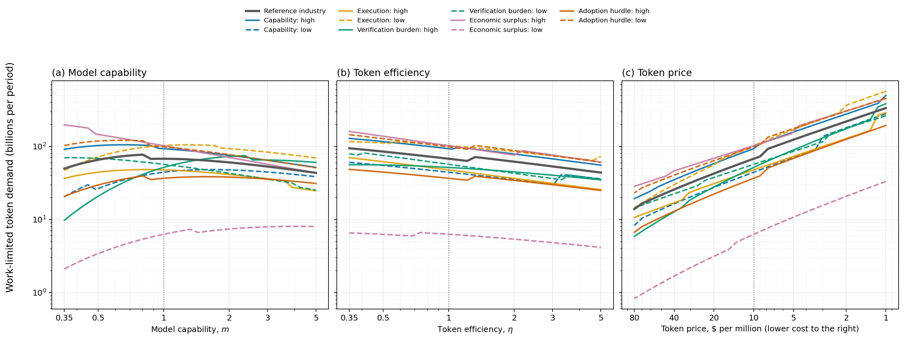

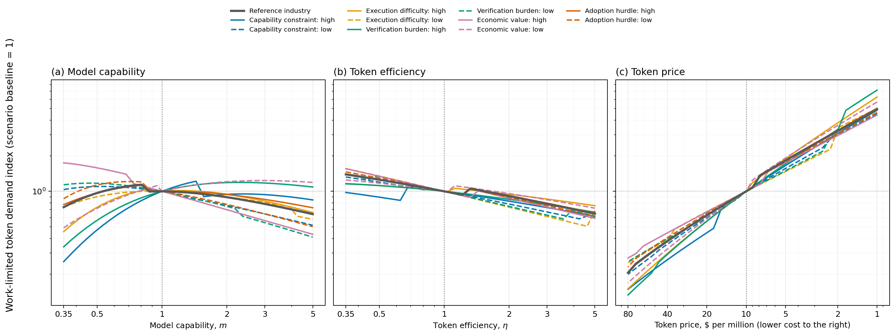

*Capability and efficiency panels use independent linear vertical scales; price uses a logarithmic scale. Price falls to the right. In the indexed price panel, the black $c_0/c$ line is the quantity increase needed to preserve baseline spending. Being above it is a comparison with the baseline, not a claim that every further price cut increases spending.*

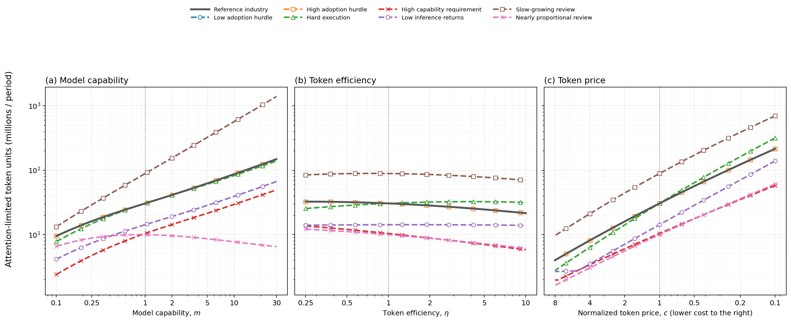

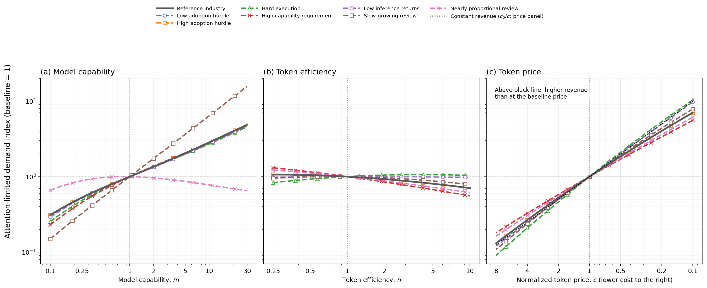

*These figures use shared logarithmic vertical scales. The concentration cases coincide with the reference because switching hurdles do not constrain the abundant-work limit. A high demand level need not imply a high growth rate; review levels, endowments, and the starting point all affect levels.*

### B.3 Additional capability and review shapes

The main argument does not require every response to be monotone or to have one peak. The next figure retains three selected attention cases, including the capability valley.

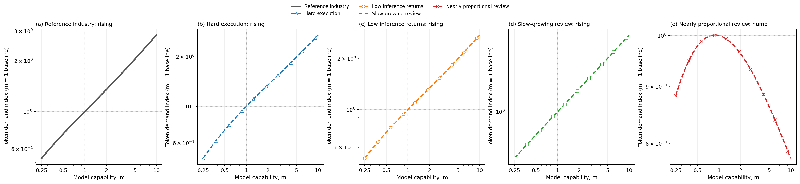

*Each panel has its own vertical range. The valley is a selected combination of low fixed overhead, weak inference returns, and review growth close to proportional. Its reversal survives nearby parameter changes in the tests. This establishes a possibility, not its prevalence or an industry forecast.*

Setting fixed overhead to zero removes that valley in the homogeneous benchmark of Appendix A. The example therefore identifies which extra structure changes the response; it does not weaken the general price or efficiency results.

The next experiment changes $\beta$, the growth of review time with scope, at capability levels $m=1$ and $m=5$.

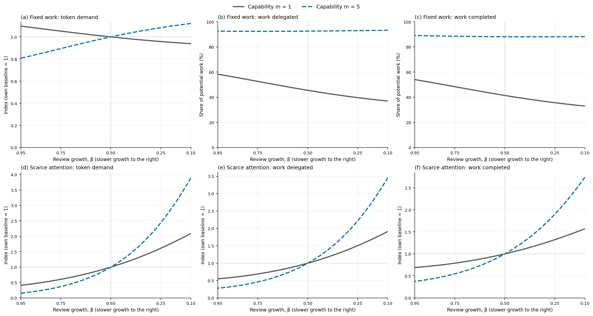

*Lower $\beta$ is to the right. The top row fixes work; the bottom row fixes attention. Columns show tokens, work assigned, and expected completed work. Work-limited assignment and completion are percentages of potential work; attention outcomes and token quantities are indexes.*

The review functions cross at one work hour: lower $\beta$ reduces review time for larger chunks but increases it for smaller ones. It is therefore not a uniform productivity improvement. In the reference work-limited case, preferred chunks are below one hour, and reducing $\beta$ lowers adoption and completion. In the attention cases shown, it supports larger chunks and raises throughput. This contrast is a consequence of the intervention's crossing point, not evidence that uniformly faster verification reduces value.

### B.4 Feasibility and large efficiency gains

A feasibility improvement raises $\lambda$ alone; the next figure compares it with the same proportional increase in $m$.

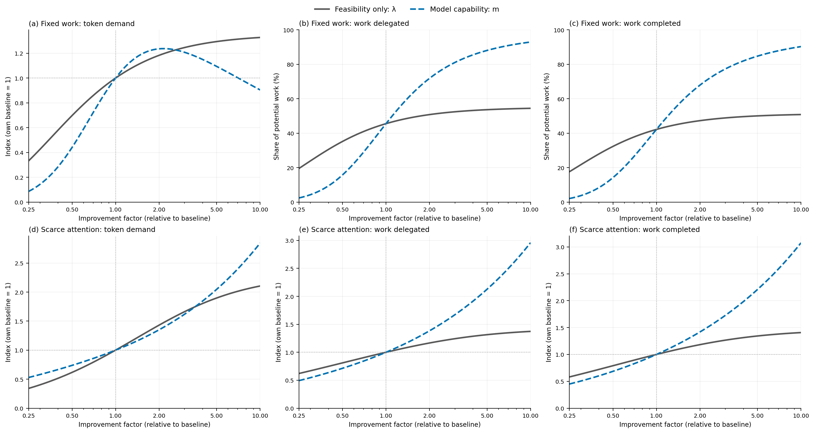

*The two changes have the same effect on the first term of the success function at a fixed scope. Higher $m$ also improves execution. Row and column meanings match Figure B6.*

At a fivefold improvement, broader capability produces more completed work but a smaller increase in work-limited token demand than feasibility alone. Execution improvements save inference on work that becomes worthwhile. A better tool or harness could affect feasibility, execution, and review together; this experiment isolates only one of those channels.

Finally, we extend token efficiency to a hundredfold improvement at three inference-return settings.

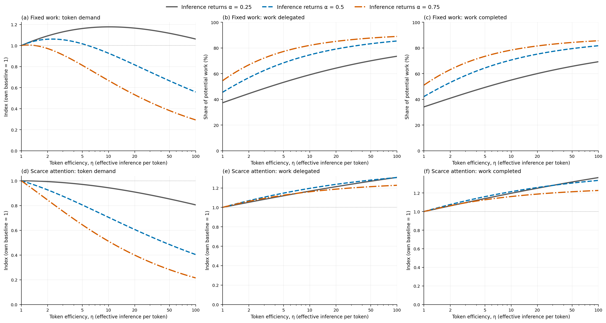

*All curves use their own $\eta=1$ baseline. Only efficiency varies along a curve. Inference-return exponents differ across curves; neither capability nor review technology changes. Row and column meanings match Figure B6.*

| Inference returns $\alpha$ | Fixed-work demand at $\eta=100$ (baseline = 1) | Scarce-attention demand at $\eta=100$ (baseline = 1) |
|---|---:|---:|
| 0.25 | 1.23 | 0.86 |
| 0.50 | 0.59 | 0.43 |
| 0.75 | 0.29 | 0.22 |

Completed work rises in every case shown. With weak inference returns, the work-limited example still uses more tokens at the endpoint because adoption expansion outweighs savings. The other work cases and all three attention cases use fewer tokens. A hundredfold efficiency improvement need not create a hundredfold reduction in token use, or any reduction at all. The ranking across $\alpha$ is conditional on the other illustrative parameters.

## Appendix C. Numerical checks and reproduction

The [analysis notebook](notebooks/comparative_statics.ipynb) regenerates all 22 PNG figures, including ten additional views not placed in the manuscript. Its plotted coordinates also generate the interactive charts; the reading edition contains no separate demand model. The four main figures reuse audited outcomes from the full comparison and intervention data.

Both numerical optimizers search a $17\times17$ grid in $(\log s,\log x)$ and refine four starts. Bounds are $s\in[0.002,800]$ and $x\in[200,200{,}000{,}000]$. No plotted optimum reaches them. Independent checks use a $25\times25$ grid, eight starts, and tenfold wider bounds at endpoints, baselines, and sampled extrema.

The attention solution is also checked through an independent scalar characterization. Write $d=(s/(\lambda m))^\nu$, $t=s/[am(\eta x/x_{\mathrm{ref}})^\alpha]$, and $\delta=1-\theta$. The interior conditions imply

```math
cx=\alpha t b\,e^{-d-t},\qquad
t=\frac{\delta-\nu d}{1+\alpha\delta}.
```

Substitution leaves one equation in $s$. The implementation rejects unsupported review technologies and solutions outside its configured bounds. Tests also check failure costs, nonnegative-hurdle adoption, both policy conditions, scarcity-price recovery of the attention policy, price-efficiency equivalence, and uniform-review scaling.

Most axes use 81 logarithmically spaced samples plus exact comparison anchors; review growth uses a linear grid. Lines join optimized samples without smoothing. Sampled peaks are not analytical turning points. Denser searches and alternative characterizations substantially reduce numerical concerns but are not a global proof for arbitrary parameter choices.

The [comparison diagnostics](figures/paradigms.json) and [intervention diagnostics](figures/interventions.json) contain configurations, policies, unindexed outcomes, and independent audit errors. The [self-review record](REVIEW.md) documents the modeling and presentation reviews, including the comparison with the requested reference papers.

Install dependencies, run checks, and regenerate the reading edition:

```bash
uv sync --extra notebook --extra dev --extra paper
uv run pytest
node --test tests/paper_controls.test.cjs
uv run token-demand-paper refresh
```

For a prose-only rebuild with valid cached plots, use `uv run token-demand-paper build`. Output is `build/paper/index.html`. To open a local preview that refreshes as sources change:

```bash
uv run token-demand-paper serve --port 8001
```

Visit [the local reading edition](http://127.0.0.1:8001). Figures support line toggles, hover values, zooming, and expanded panels; static PNGs are used for printing and when scripts are unavailable. Full comparison plots remain available for readers who want to inspect parameter differences.

To share a static edition, copy the entire `build/paper/` directory. Plotly and chart data are packaged locally; equation typesetting uses a pinned MathJax CDN and needs internet access. Generated HTML is excluded from version control. The manuscript, figure sources, figures, and cached data are tracked. The preview serves generated files locally and does not publish the paper.
