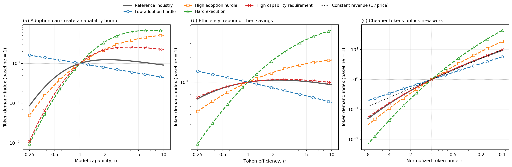
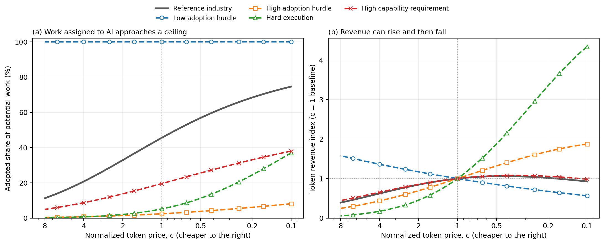
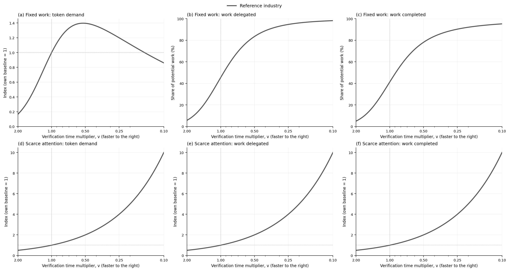

# Modeling Token Demand

## Delegation, inference, and scarce human attention

**Working draft — single-attempt model**

## Abstract

The amount of economic work exposed to AI does not by itself determine demand for inference. Users choose how much work to delegate, how much computation to devote to it, and whether the expected result is worth the token spending and human review. We model these choices with two policy variables: delegated scope and inference intensity. Each chunk is processed once and verified once. Failure produces no completed work, but consumes the full token budget and review time.

The resource constraint determines the user's objective. With limited work, users maximize surplus per work unit, and token demand equals adopted work times inference intensity. With abundant work and limited attention, users maximize surplus per review hour, and demand equals attention capacity times work supervised per hour times inference intensity. These objectives generally select different policies.

The model distinguishes adoption takeoff, saturation, inference savings, and limits to supervision. Capability and efficiency increase optimized value but can raise or lower token demand. A pure token-price reduction weakly increases quantity, while revenue can move either way. Uniformly faster verification scales active attention-limited demand in exact inverse proportion. Illustrative industries exhibit rising demand, humps, and a capability valley without an additional decision about repeated processing. The purpose is to explain these qualitative regimes, not to forecast their numerical size.

## 1. Introduction

A forecast that assigns some fraction of wages or business spending to AI describes a possible market, but does not explain how that market becomes token purchases. The missing link is user behavior. A more capable model may need fewer tokens for a familiar task, make additional tasks worth delegating, or let one reviewer supervise a larger volume of work. These responses need not have the same effect on inference demand.

We represent the user's interaction policy with two choices. The **delegation horizon** $s$ is the amount of underlying work assigned before human verification. **Inference intensity** $x$ is the number of tokens devoted to each unit of that work. A larger $s$ reduces the frequency of checkpoints but makes the delegated chunk harder to complete. A larger $x$ improves execution but costs more. In applications, $x$ can represent a larger inference budget; comparisons across different model sizes require a common compute-equivalent token unit.

The model separates task feasibility from execution. Some work lies outside a capability frontier even with very large inference budgets. Feasible work can also be executed incorrectly. Every delegated chunk uses tokens and review time regardless of its outcome. Consequently, failure remains costly when work is scarce and when attention is scarce: it consumes the relevant resources without producing successful output.

We first derive behavior under the two resource constraints, then examine capability, efficiency, price, and verification. Numerical examples show how industry differences change the response. The examples are deliberately stylized. Their role is to establish mechanisms and possible demand shapes, not to attach a forecast to a named industry.

## 2. Model

Industries are indexed by $i$. Underlying work is measured in human-hour-equivalents. This unit measures task scope; it does not require that a human perform the work.

### 2.1 Policy and technology

A user chooses $(s,x)$, where $s>0$ is work per delegated chunk and $x>0$ is tokens per work unit. Each chunk receives one attempt followed by one human review. It either completes successfully or contributes no completed work during the modeled period. Its token use is

```math
T(s,x)=sx.
```

Increasing scope and increasing inference intensity are different choices. Grouping the same work into larger chunks does not mechanically require more tokens per work unit.

Four scenario variables describe technology and prices: model capability $m>0$, token efficiency $\eta>0$, price per token $c>0$, and a verification-time multiplier $v>0$. Higher $\eta$ means more effective inference per token; lower $v$ means faster review. The reference intensity $x_{\mathrm{ref}}>0$ normalizes token units inside the execution function.

### 2.2 Feasibility and execution

The share of tasks at scope $s$ that fall inside the capability frontier is

```math
q_i(s;m)=\exp\left[-\left(\frac{s}{\lambda_i m}\right)^{\nu_i}\right].
```

The scale $\lambda_i>0$ determines the capability horizon, and $\nu_i>0$ determines its shape. Conditional on feasibility, the delegated chunk succeeds with probability

```math
r_i(s,x;m,\eta)
=\exp\left[-\frac{s}
{a_i m[\eta(x/x_{\mathrm{ref}})]^{\alpha_i}}\right].
```

Here $a_i>0$ measures execution ease, and $0<\alpha_i<1$ gives diminishing growth of the execution horizon in effective inference. Overall success is simply

```math
P_i(s,x;m,\eta)=q_i(s;m)r_i(s,x;m,\eta).
```

Feasibility is not known before assignment; otherwise the user could screen out infeasible work before paying its costs. Capability $m$ improves both feasibility and execution. Efficiency $\eta$ improves execution at a given token budget without expanding the feasible set. At fixed scope, increasing inference without limit gives $P_i\to q_i$, rather than mechanically making all work successful.

The parameters $\lambda_i$ and $a_i$ describe task tractability, not a universal return on model intelligence. Our $m$ is a proportional extension of the two technical horizons, not a measured intelligence score; real model improvements need not move both horizons equally. The local gain from capability depends on the constraints currently facing the chosen task:

```math
\frac{\partial\log P_i}{\partial\log m}
=\nu_i\left(\frac{s}{\lambda_i m}\right)^{\nu_i}
+\frac{s}{a_i m[\eta(x/x_{\mathrm{ref}})]^{\alpha_i}}.
```

A user may respond to that gain by changing scope or inference intensity, so this fixed-policy expression does not determine token demand.

### 2.3 Verification and the cost of failure

Review of each chunk requires

```math
h_i(s;v)=v\left(h_{0,i}+h_{1,i}s^{\beta_i}\right)
```

human hours. Fixed checkpoint overhead is $h_{0,i}\geq0$, the variable review scale is $h_{1,i}>0$, and $\beta_i\geq0$ governs how review grows with scope. Verification detects success perfectly in this specification.

Let $b_i>0$ be the value of a successfully completed work unit and $w_i>0$ the opportunity cost of a review hour. Cost and expected surplus per delegated work unit are

```math
C_i(s,x)=cx+w_i\frac{h_i(s;v)}{s},
\qquad
u_i(s,x)=b_iP_i(s,x)-C_i(s,x).
```

Both costs are paid on every chunk. In particular,

```math
u_i=P_i(b_i-C_i)+(1-P_i)(-C_i)=b_iP_i-C_i.
```

A failed chunk therefore loses its token spending and attention cost. It also forgoes the value of successful work. There is no need for an extra failure penalty to make reliability matter. If $P_i=0$, surplus is $-C_i$, not zero.

Over many comparable chunks, tokens per expected completed work unit are $x/P_i$, and review hours per expected completed work unit are $h_i/(sP_i)$ when $P_i>0$. These are ratios of expected totals. Demand accounting below instead counts all delegated work, including failures, so it does not multiply expenditures by success or treat failed reviews as unused capacity.

The value of output $b_i$ and the price of attention $w_i$ are distinct. Higher $b_i$ rewards reliable completion; higher $w_i$ makes review more expensive. A binding attention budget adds a quantity constraint even when attention already carries this monetary cost.

## 3. User behavior under alternative constraints

The numerical comparisons use one shared set of fourteen cases: a reference, five high/low pairs, and three singleton configurations. Each pair changes a related parameter group; singletons illustrate additional combinations. Gray denotes the reference, solid/dashed lines denote high/low settings within a color group, and dash-dot lines denote singletons.

Parameters run down the rows and conditions across the columns. **Bold values differ from the reference.** Unlisted parameters retain their reference values.

**Technical conditions**

| Parameter | Reference | Capability low | Capability high | Execution low | Execution high | Review low | Review high |
|---|---:|---:|---:|---:|---:|---:|---:|
| Capability horizon $\lambda$ | 12 | **24** | **6** | 12 | 12 | 12 | 12 |
| Frontier shape $\nu$ | 1.25 | **1.5** | **1** | 1.25 | 1.25 | 1.25 | 1.25 |
| Execution ease $a$ | 4 | 4 | 4 | **8** | **2** | 4 | 4 |
| Inference returns $\alpha$ | 0.5 | 0.5 | 0.5 | **0.65** | **0.35** | 0.5 | 0.5 |
| Fixed review $h_0$ (hours) | 0.03 | 0.03 | 0.03 | 0.03 | 0.03 | **0.015** | **0.06** |
| Review scale $h_1$ | 0.05 | 0.05 | 0.05 | 0.05 | 0.05 | **0.025** | **0.1** |
| Review growth $\beta$ | 0.5 | 0.5 | 0.5 | 0.5 | 0.5 | **0.25** | **0.95** |

**Economic and adoption conditions**

| Parameter | Reference | Value low | Value high | Concentration low | Concentration high |
|---|---:|---:|---:|---:|---:|
| Work value $b$ (dollars) | 100 | **50** | **200** | 100 | 100 |
| Hurdle spread $\sigma$ (dollars) | 4 | 4 | 4 | **16** | **1** |
| Hurdle location $\mu$ (dollars) | 76 | 76 | 76 | 76 | 76 |

**Singleton conditions**

| Parameter | Reference | Early saturation | Capability valley | Offsetting efficiency |
|---|---:|---:|---:|---:|
| Capability horizon $\lambda$ | 12 | **36** | **36** | **36** |
| Execution ease $a$ | 4 | **8** | 4 | **2** |
| Inference returns $\alpha$ | 0.5 | 0.5 | **0.25** | 0.5 |
| Fixed review $h_0$ (hours) | 0.03 | 0.03 | **0.001** | 0.03 |
| Review growth $\beta$ | 0.5 | 0.5 | **0.9** | **0.8** |
| Hurdle spread $\sigma$ (dollars) | 4 | **1** | 4 | 4 |

All cases use $w_i=100$ dollars per review hour, $W_i=1{,}000{,}000$ potential work units in the work-limited comparison, and $H_i=100{,}000$ review hours in the attention-limited comparison. The scenario baseline is $m=\eta=v=1$, with tokens priced at 10 dollars per million and $x_{\mathrm{ref}}=100{,}000$. These common endowments make the figures comparable; their levels are illustrative.

The location of the underlying adoption distribution is $\mu=76$, close to the single-attempt reference surplus of about $75.3$. This places the example near an adoption transition. It is a calibration choice, not an estimated industry hurdle, and stays fixed in every comparative static. High, reference, and low adoption concentration use spreads $\sigma=1$, $4$, and $16$. High concentration means work opportunities have similar switching thresholds; it does not mean their thresholds are uniformly higher.

The technical high/low settings have the stated same-policy difficulty ordering over the plotted comparisons, which the notebook checks. Shape parameters are not globally ordered. The concentration CDFs cross near their common location: concentration reduces adoption below the transition and raises it above it. Conditioning on positive hurdles shifts the crossings slightly away from $\mu$. The examples establish possible behavior rather than its prevalence across industries.

### 3.1 Limited work, nonbinding attention

Suppose potential work $W_i$ is fixed and attention is available at opportunity cost $w_i$. A user chooses the policy that maximizes expected surplus per work unit:

```math
(s_i^W,x_i^W)\in\arg\max_{s>0,\,x>0}u_i(s,x),
\qquad
u_i^W=u_i(s_i^W,x_i^W).
```

A work opportunity switches to AI if this surplus exceeds its adoption threshold $\phi$, which incorporates the value of its current alternative and any switching hurdle. The threshold is nonnegative and does not depend on $(s,x)$, so every opportunity prefers the same policy before deciding whether to adopt. All heterogeneity here concerns outside options, not task difficulty. For numerical illustrations, use a logistic distribution conditioned on positive thresholds:

```math
A_i=F_i(u_i^W),\qquad
F_i(u)=\begin{cases}
0,&u\leq0,\\
\displaystyle\frac{1-\exp(-u/\sigma_i)}{1+\exp[-(u-\mu_i)/\sigma_i]},&u>0.
\end{cases}
```

No work is adopted at nonpositive surplus. The location $\mu_i$ is that of the underlying logistic, not the exact median after conditioning. The analytical results require only a nondecreasing distribution of nonnegative hurdles. Adoption is work assigned to AI, not successful completion. With $W_iA_i/s_i^W$ chunks, the three relevant outcomes are

```math
\text{Delegated work}=W_iA_i,
\qquad
\text{Completed work}=W_iA_iP_i^W,
\qquad
D_i^W=W_iA_ix_i^W.
```

The horizon cancels from token accounting because the total amount of underlying work is fixed. It still matters through reliability, review cost, the chosen inference intensity, and adoption. A failure consumes its allocated work opportunity and resources without adding completed output.

For interior choices, marginal benefit equals marginal cost:

```math
b_iP_{i,x}=c,
\qquad
b_iP_{i,s}=w_i\frac{s h_{i,s}-h_i}{s^2}.
```

Subscripts denote partial derivatives. An interior choice is one not pinned to an action bound. For $\beta_i\leq1$, longer chunks weakly reduce review cost per work unit because $s h_{i,s}-h_i\leq0$. The user balances that saving against lower reliability. Additional inference is worthwhile until its marginal contribution to expected output equals its token cost.

The next figures reoptimize both choices and allow adoption to respond. Capability spans $0.1$ to $30$, efficiency spans $0.25$ to $10$, and price spans 1 to 80 dollars per million. Capability and efficiency use independent linear y-axes; the price panel uses a logarithmic y-axis to show very small adoption tails.


Each indexed curve divides by its own demand at the scenario baseline. It does not divide by the reference industry's demand at each point. In the price panel, the black line $c_0/c$ is the demand increase required to preserve baseline revenue.


#### Adoption takeoff and saturation

The focused view selects three cases from the same table. Near a concentrated adoption threshold, a modest surplus improvement can move a large amount of work onto AI. When adoption is already high, the remaining response increasingly reflects tokens saved per work unit.



For illustration, halving price from 10 to 5 dollars per million in the concentrated case raises adoption from **32.6% to 80.4%**, demand **4.20 times**, and revenue **2.10 times**. The qualitative mechanism is the mass of work near its switching threshold; the magnitude depends on the illustrative calibration.

The concentrated case also exhibits a capability hump and an efficiency hump. Early gains expand adoption enough to outweigh lower inference intensity; later gains increasingly save tokens after most work has switched. The early-saturation case has easier execution and a broader capability frontier, with about 99.5% adoption at baseline. Its peaks occur earlier, and additional capability or efficiency beyond baseline reduces token use over the displayed range. These are optimized sampled responses, not universal turning-point locations.



An adoption plateau is not a token-demand plateau. Even after nearly all work is assigned to AI, cheaper tokens can induce more inference per work unit. Revenue can rise and then fall while token quantity continues rising. Completed work remains $W_iA_iP_i$, so an increase in adoption is also distinct from an equal increase in successful output.

### 3.2 Limited attention, abundant work

Now suppose useful work is abundant but only $H_i$ review hours are available. If the user launches $N_i$ chunks, the problem is

```math
\max_{s>0,\,x>0,\,N_i\geq0}N_i s u_i(s,x)
\quad\text{subject to}\quad
N_i h_i(s;v)\leq H_i.
```

Every chunk consumes a review slot, including a failed one. Conditional on positive operating value and binding attention, $N_i=H_i/h_i$. Substitution gives the policy objective

```math
J_i(s,x)=\frac{s}{h_i(s;v)}[b_iP_i(s,x)-cx]-w_i,
\qquad
(s_i^H,x_i^H)\in\arg\max_{s>0,\,x>0}J_i(s,x).
```

The user maximizes expected surplus per scarce review hour. If the maximum net value is nonpositive, choosing $N_i=0$ is optimal. The numerical attention comparisons verify positive operating value throughout.

The endowment $H_i$ scales activity without changing the conditional policy. Likewise, $w_i$ is a constant in this objective: it affects participation but not the preferred policy while attention binds. Adoption thresholds do not enter this polar case because enough useful work is assumed available.

Define **supervisory leverage** as $L_i(s)=s/h_i(s;v)$, the amount of work launched per review hour. Then

```math
\text{Delegated work}=H_iL_i^H,
\qquad
\text{Completed work}=H_iL_i^HP_i^H,
\qquad
D_i^H=H_iL_i^Hx_i^H.
```

Higher reliability increases completed output and the value of the review budget. It does not automatically lower token use at a fixed policy: the same resources were already consumed by the failed work.

Let $\theta_i(s)=s h_{i,s}/h_i$ be the elasticity of review time with respect to scope. The interior policy conditions are

```math
b_iP_{i,x}=c,
\qquad
(1-\theta_i)(b_iP_i-cx)+s b_iP_{i,s}=0.
```

The inference condition has the same form as in the work-limited problem, but it is evaluated at a different scope. The scope condition values work launched per attention hour rather than savings in review cost per fixed work unit. Optimizing $u_i$ and then imposing an attention cap generally misses this policy response.


These figures use shared logarithmic y-scales. The concentration cases coincide with the reference because the adoption distribution is irrelevant when useful work is abundant. The interactive edition lets readers isolate those overlapping curves.

#### Verification determines the scope for expansion

The focused capability comparison separates three shapes: sustained growth with low verification burden, a hump with high verification burden, and a fall followed by a rise in the capability-valley case.


At fixed $H_i$ and $v$, the capability response decomposes as

```math
\frac{d\log D_i^H}{d\log m}
=(1-\theta_i)\frac{d\log s_i^H}{d\log m}
+\frac{d\log x_i^H}{d\log m}.
```

Demand falls when inference savings outweigh increased supervisory leverage. In the valley, this balance later reverses. Fixed review overhead matters for that transition. If instead $h_{0,i}=0$ and $0\leq\beta_i<1$, the unconstrained interior solution has $s_i^H\propto m$ and constant $x_i^H$, giving $D_i^H\propto m^{1-\beta_i}$. The notebook verifies this scaling benchmark and checks the valley under nearby parameter changes.

### 3.3 When both resources matter

A scarce review hour has an opportunity cost beyond its wage. Let $\tau\geq0$ be the shadow price of the shared attention constraint. For divisible work with the same technical characteristics and hurdle distribution as above, the policy solves

```math
(s_\tau,x_\tau)\in\arg\max_{s,x}
\left\{bP(s,x)-cx-(w+\tau)\frac{h(s)}s\right\},
\qquad u_\tau=\max_{s,x}\left\{bP-cx-(w+\tau)h/s\right\}.
```

Work adopts when its hurdle is below $u_\tau$. The scarcity price must satisfy

```math
W F(u_\tau)\frac{h(s_\tau)}{s_\tau}\leq H,
\qquad
\tau\left[H-WF(u_\tau)\frac{h(s_\tau)}{s_\tau}\right]=0.
```

These conditions follow by charging each work opportunity for the attention it consumes. If several policies tie, work can be split among them to clear the attention constraint. This allocation interpretation assumes a common scarcity price within the industry.

With ample attention, $\tau=0$ recovers the work-limited policy. With an increasingly large pool of opportunities and hurdles approaching zero, the limiting policy maximizes surplus per review hour: $\tau\to\max J$. Thus the two regimes have a common economic foundation. The numerical exercises study their polar limits rather than solving every intermediate allocation.

A minimum of work capacity and review capacity can describe feasible throughput at a supplied policy. It cannot select the optimal policy, because a binding attention constraint changes the relevant price of review. Aggregate demand can be added across industries only after their policies and constraints have been determined.

### 3.4 Interpreting industry regimes

The relevant distinction is the combination of available work, review technology, and adoption conditions. Industry names alone do not determine the demand response.

| Industry conditions | Main margin | Qualitative demand implication |
|---|---|---|
| Finite workload with substantial remaining adoption | Work switches to AI as surplus improves | Adoption can outweigh inference savings and generate takeoff or a hump |
| Finite workload with adoption near saturation | Tokens used per adopted work unit | Capability or efficiency savings have less remaining adoption growth to offset them |
| Abundant work with slowly growing review time | Work supervised per attention hour | Expanding scope can support substantial demand growth |
| Abundant work with nearly proportional review | Limited expansion of supervisory leverage | Inference savings can dominate, producing weak growth or falling demand |
| A transition from fixed overhead to scope-dependent review | Changing balance of scope and inference | Capability can generate a hump or a valley even as optimized value rises |

These are conditional mechanisms, not claims that every parameter configuration in a row has the same shape. A real industry can move between them as adoption grows or the binding resource changes.

## 4. How technology and prices affect token demand

Each comparison changes one input, holds the other inputs fixed, and allows the user to reoptimize. The results concern static choices, not the speed of adoption or organizational adjustment.

| Change | Effect on value or feasibility | Effect on optimized token demand |
|---|---|---|
| Capability $m$ rises | Feasibility and execution improve at a fixed policy | Ambiguous in either regime |
| Efficiency $\eta$ rises | The same effective inference costs fewer tokens | Ambiguous in either regime |
| Token price $c$ falls | The same policy becomes cheaper | Quantity weakly rises; revenue is ambiguous |
| Verification multiplier $v$ falls | Every chunk takes less review time | Proportional to $1/v$ with binding attention; otherwise policy-dependent |

### 4.1 Capability and the value of attention

A higher $m$ raises $P_i$ at every fixed $(s,x)$ without changing token or review expenditure. The old policy remains available, so optimized surplus cannot fall. Token demand can fall because the user changes inference intensity, even as more work becomes worthwhile or easier to supervise.

There is a sharper result for the value of attention. Define value per review hour after token spending but before the separate attention charge:

```math
R_i(s,x)=\frac{s}{h_i(s;v)}[b_iP_i(s,x)-cx],
\qquad
\rho_i^*=\max_{s,x}R_i(s,x).
```

In the active attention-limited regime, the marginal net value of additional capacity is $\rho_i^*-w_i$. If $h_{0,i}>0$, $0\leq\beta_i\leq1$, and the optimal policy is interior, the envelope theorem and the scope condition give

```math
\frac{d\log\rho_i^*}{d\log m}=1-\theta_i(s_i^H),
\qquad
\theta_i(s)=\frac{\beta_i h_{1,i}s^{\beta_i}}
{h_{0,i}+h_{1,i}s^{\beta_i}}.
```

The elasticity lies between $1-\beta_i$ and $1$. To see why, capability and scope enter reliability through $s/m$, so $mP_{i,m}=-sP_{i,s}$. The scope first-order condition converts the marginal reliability gain into the elasticity of supervisory leverage. Slow review growth makes additional capability especially valuable per attention hour.

This is a value result, not a token-volume result. With fixed work, $D_i^W=W_iA_ix_i^W$ rises only if the combined change in adoption and inference intensity is positive. With fixed attention, $D_i^H=H_iL_i^Hx_i^H$ rises only if their leverage and inference counterparts sum to a positive change. The notebook separately plots optimized surplus, gross attention value, and demand to keep these outcomes distinct.

### 4.2 Efficiency, rebound, and saturation

Write effective inference as $z=\eta x$. Holding $z$ fixed preserves reliability while changing token cost to $(c/\eta)z$. With unrestricted positive policies, or nonbinding bounds that respect this change of units, either polar regime satisfies the exact demand identity

```math
D(c,\eta)=\frac{1}{\eta}D(c/\eta,1),
```

with other inputs held fixed. Efficiency has two effects: effective inference becomes cheaper, and each unit of it requires fewer raw tokens.

Define the local price elasticity of token quantity at unit efficiency as $\epsilon_c=-\partial\log D(c,1)/\partial\log c$. Where demand is differentiable,

```math
\frac{\partial\log D(c,\eta)}{\partial\log\eta}
=\epsilon_c(c/\eta)-1.
```

There is an equally useful result for a finite improvement by a factor $k>1$. Let $S(c,\eta)=cD(c,\eta)$ denote token spending. Then

```math
\frac{D(c,k\eta)}{D(c,\eta)}
=\frac{S(c/k,\eta)}{S(c,\eta)}.
```

A $k$-fold efficiency improvement changes raw-token demand by exactly the same proportion as a $k$-fold price cut changes spending. Price and efficiency therefore need not be separate forecasting exercises under these assumptions: the spending response to a price experiment identifies the sign of efficiency rebound.

An efficiency gain increases raw token demand when the induced expansion is more than proportional to the effective price reduction. In the work-limited case that expansion includes adoption. Once adoption approaches its ceiling, fewer new work opportunities remain to offset token savings, which can produce an efficiency hump. With scarce attention, the corresponding expansion operates through supervisory leverage and inference choices.

### 4.3 Price, quantity, and revenue

A pure price reduction weakly increases optimized token quantity in both polar regimes. In the work-limited problem, revealed preference implies that chosen $x$ weakly increases as $c$ falls; optimized surplus and hence adoption also weakly increase. Their product $W_iA_ix_i^W$ therefore cannot fall. In the attention-limited problem, price multiplies tokens per review hour directly in the objective, so the same comparison applies to $L_i^Hx_i^H$.

Revenue, equal to user token spending, is $S(c)=cD(c)$. A small price cut raises revenue only when quantity has price elasticity greater than one. For a finite change, the exact comparison is

```math
\frac{S(c)}{S(c_0)}
=\frac{c}{c_0}\frac{D(c)}{D(c_0)}.
```

The indexed price figures therefore compare demand with $c_0/c$. Being above that line means revenue exceeds the baseline, without implying that every further price cut will increase it. A revenue response to cheaper tokens and a resource-use response to improved efficiency are distinct comparisons, connected here by the effective-inference identity.

### 4.4 Verification technology

Uniformly faster review has an exact effect under binding attention. Since $h_i(s;v)=v h_i(s;1)$,

```math
J_i(s,x;v)=\frac{1}{v}R_i(s,x;1)-w_i.
```

Multiplication by $1/v$ does not change the preferred $(s,x)$. If the user operates and attention binds before and after the change, then

```math
\begin{aligned}
D_i^H(v)&=\frac{D_i^H(1)}{v},\\
\text{Delegated work}(v)&=\frac{\text{Delegated work}(1)}{v},\\
\text{Completed work}(v)&=\frac{\text{Completed work}(1)}{v}.
\end{aligned}
```

Halving review time doubles all three outcomes without changing success per chunk. The result requires enough available work to use the expanded capacity. With fixed work, faster review changes surplus, adoption, and the preferred policy, so no proportional demand rule applies.

Changing $\beta_i$ is a different intervention. It changes the shape of review costs and therefore the policy itself. In the chosen work units, review time at $s=1$ is unchanged: lower $\beta_i$ makes larger chunks cheaper to review but smaller chunks more expensive. It cannot be interpreted as a uniform improvement on every task.

## 5. Which improvements increase token demand and automation?

Four experiments separate token demand from work delegated and work successfully completed. Each figure has the same layout. The top row fixes potential work at $W=1{,}000{,}000$ and allows adoption to change. The bottom row fixes attention at $H=100{,}000$ with abundant work. Columns show tokens, delegated work, and expected completed work.

Work-limited delegation and completion are percentages of potential work, $A$ and $AP$. Attention-limited outcomes are throughput indexes, not market adoption rates. All other indexes use the case's own experiment baseline. Completed work still requires human verification; it is not a measure of autonomous jobs or labor displacement.

### 5.1 What if verification took half as long?

The first experiment changes $v$ while holding the shape of review costs fixed. Moving right makes every checkpoint faster.



With binding attention, halving $v$ exactly doubles tokens, delegated work, and completed work. With fixed work, the same intervention raises reference adoption from about 45% to 83%, while token demand rises by about 40%. Better review can therefore support a much larger increase in completed work than in token use. The response reflects adoption and continuous adjustments to scope and inference.

### 5.2 What if review grew more slowly with task size?

The second experiment changes $\beta$ at capability levels $m=1$ and $m=5$, holding the review-time scale parameters fixed. Moving right reduces review growth; each curve is indexed at $\beta=0.5$.


With scarce attention, slower review growth supports larger chunks and raises demand and completed work in these examples. The expansion is stronger at the higher capability level, where longer chunks are technically attractive.

The work-limited result depends on which side of the one-hour crossing the chosen scope lies. Near the reference baseline, chunks are shorter than one hour, and lowering $\beta$ raises review time at those scopes. Adoption and completed work fall. At higher capability, adoption rises slightly instead, but that does not ensure a rise in completed work: reliability also changes with the chosen scope. The distinction between $A$ and $AP$ is economically relevant even without changing the amount of available work.

### 5.3 What if a better harness made more tasks feasible?

The third experiment increases $\lambda$ alone and compares it with the same proportional increase in $m$. Increasing $\lambda$ represents a feasibility improvement while holding execution and review technology fixed.


Both changes produce the same $q$ at a fixed horizon because feasibility depends on $\lambda m$. Higher $m$ also improves execution; higher $\lambda$ alone does not. A real harness could affect execution or review as well, but those effects are outside this isolated comparison.

At a fivefold improvement, both interventions raise work-limited demand in the reference example. Broader capability produces much more completed work, yet a smaller token-demand increase than the feasibility-only change. Improved execution saves inference on work that becomes feasible. At larger capability gains, the token-saving margin can outweigh further adoption, as the main capability figures show. Under scarce attention, both interventions expand demand and successful throughput in the displayed comparison.

Changing $\nu$ would alter frontier shape rather than uniformly expand feasibility: its effect on $q$ changes sign at $s=\lambda m$. The $\lambda$ experiment avoids that ambiguity.

### 5.4 What if each token became 100 times more efficient?

The final experiment raises $\eta$ from 1 to 100 at three inference-return settings, $\alpha=0.25$, $0.5$, and $0.75$. All other industry parameters, capability, and raw-token price are fixed. Each curve uses its own $\eta=1$ baseline.


| Inference returns $\alpha$ | Fixed-work demand at $\eta=100$ (baseline = 1) | Scarce-attention demand at $\eta=100$ (baseline = 1) |
|---|---:|---:|
| 0.25 | 1.23 | 0.86 |
| 0.50 | 0.59 | 0.43 |
| 0.75 | 0.29 | 0.22 |

Expected completed work increases in every case, but raw token use does not move uniformly. With weak inference returns, the work-limited example still uses more tokens after the hundredfold efficiency gain: increased adoption outweighs lower intensity per adopted work unit. The other two work-limited cases save tokens. All three attention-limited cases save tokens at the endpoint while completing more work.

A hundredfold improvement in effective inference therefore need not yield a hundredfold reduction in demand, or even a reduction at all. These are conditional examples, not a universal ranking of $\alpha$: changing the adoption distribution or review technology changes the balance. Efficiency does not move $q$ directly, so it also cannot eliminate the capability limit at a fixed task scope.

The [analysis notebook](notebooks/comparative_statics.ipynb) regenerates these experiments. The [experiment diagnostics](figures/interventions.json) retain configurations, policies, unindexed outcomes, and independent numerical checks.

## 6. Measurement and limitations

Applying the model requires evidence about task feasibility, execution, review, economic value, adoption, and available resources. Useful measurements include:

- success over task scope and inference budgets, with enough information to distinguish feasibility from execution;
- tokens and review time for failures as well as successful work;
- review overhead and how review time grows with delegated scope;
- work value, attention cost, and the distribution of switching thresholds;
- potential work, review capacity, and the actual policies users choose.

A single pass rate does not identify $q$ and $r$ separately. Likewise, tokens per completed task combine scope, intensity, and success; they do not identify total demand or its binding constraint. Adoption and successful automation should be measured separately.

This is a static model with one processing and review cycle per chunk, perfect verification, and common work value within an industry apart from adoption thresholds. Failed work contributes no completion in the period. Repair, learning, partial credit, reusable setup, latency, parallel processing, model routing, and variation among input, cached, reasoning, and output tokens are outside the specification. Such features can matter in applications, but are not needed for the qualitative mechanisms studied here.

The numerical cases are illustrative configurations rather than empirical industry estimates. They cover the two polar resource regimes; changes in the binding constraint, allocation of attention across industries, and joint selection with heterogeneous work require additional modeling. Endogenous prices and the supply of inference are also held outside the comparative statics.

## 7. Conclusion

A two-choice interaction policy is enough to make token demand depend on user behavior and industry constraints. Failure reduces expected output while leaving token and review expenditures in place. With limited work, demand is adoption times inference intensity. With limited attention, demand is supervisory leverage times inference intensity, scaled by the review budget.

Capability, efficiency, and verification can create economic value while having different effects on token use. Adoption takeoff, saturation, review burden, and the scope of delegation determine which response dominates. Forecasting demand requires measuring those margins and identifying the binding resource, rather than translating economic exposure directly into token spending.

## Appendix A. Notation

| Symbol | Definition |
|---|---|
| $i$ | Industry index |
| $s$ | Underlying work per delegated chunk and checkpoint |
| $x$ | Tokens per delegated work unit |
| $N_i$ | Number of chunks launched during the period |
| $m$ | Model capability |
| $\eta$ | Effective inference per token |
| $c$ | Price per token |
| $v$ | Verification-time multiplier |
| $x_{\mathrm{ref}}$ | Reference intensity used to normalize execution |
| $\lambda_i$, $\nu_i$ | Capability-frontier scale and shape |
| $a_i$, $\alpha_i$ | Execution ease and inference-return parameter |
| $q_i$ | Share of tasks inside the capability frontier |
| $r_i$ | Success probability conditional on feasibility |
| $P_i=q_ir_i$ | Probability the chunk completes successfully |
| $h_{0,i}$, $h_{1,i}$, $\beta_i$ | Review overhead, scale, and growth parameter |
| $h_i$ | Review hours per chunk, paid regardless of outcome |
| $\theta_i$ | Local elasticity of review time with respect to scope |
| $L_i=s/h_i$ | Work launched per review hour |
| $b_i$ | Value per successfully completed work unit |
| $w_i$ | Opportunity cost per review hour |
| $C_i$ | Token and review cost per delegated work unit |
| $u_i$ | Expected surplus per delegated work unit |
| $J_i$ | Expected net surplus per review hour |
| $R_i$ | Value per review hour after tokens and before the attention charge |
| $\rho_i^*$ | Optimized value of $R_i$ |
| $\phi$, $\mu_i$, $\sigma_i$ | Nonnegative hurdle, underlying logistic location, and spread |
| $A_i$ | Share of potential work assigned to AI |
| $W_i$, $H_i$ | Potential work and available review hours |
| $D_i^W$, $D_i^H$ | Token demand under the two polar constraints |
| $D_i$, $D$ | Industry and aggregate token demand |
| $S=cD$ | Token spending, also supplier revenue |
| $\epsilon_c$ | Positive price-elasticity convention, $-\partial\log D/\partial\log c$ |

Superscripts $W$ and $H$ identify the applicable resource objective. A star denotes an optimum; subscripts $s$, $x$, and $m$ on functions denote partial derivatives.

## Appendix B. Numerical implementation

The economic evaluator, policy optimizer, and manuscript renderer have separate roles:

- `Industry` holds fixed technical, economic, adoption, and capacity parameters; `Scenario` holds $m$, $\eta$, $c$, and $v$.
- `Policy` contains only `delegation_hours` and `tokens_per_work_hour`.
- `IndustryModel` evaluates $P=qr$, unconditional resource costs, surplus, adoption, and token capacity at a candidate policy.
- `PolicyOptimizer` maximizes surplus per work unit; `AttentionConstrainedOptimizer` maximizes surplus per review hour.
- `calibrations.py` supplies the common fourteen cases; the focused views select subsets of that same set.
- `paradigms.py` and `interventions.py` generate the focused experiments and audits through the notebook.

`PolicyOutcome.success_probability` is completion probability. `cost_per_work_hour` includes tokens and attention on every chunk, and `verification_hours_per_chunk` counts a review regardless of success. The evaluator's `realized_tokens` is the capacity implied by a supplied policy, with any configured work and attention caps; it does not solve the joint allocation or decide whether to operate. Attention-limited plots use their dedicated demand field and verify positive net operating value.

```python
from dataclasses import replace
from modeling_token_demand import (
    AttentionConstrainedOptimizer, IndustryModel, Policy, PolicyOptimizer, Scenario,
)
from modeling_token_demand.calibrations import REFERENCE_INDUSTRY

industry = replace(REFERENCE_INDUSTRY, human_attention_hours=100_000)
model = IndustryModel(industry)
scenario = Scenario(model_capability=1, token_efficiency=1,
                    token_price_per_million=10)

candidate = model.evaluate(Policy(delegation_hours=1,
                                  tokens_per_work_hour=100_000), scenario)
work_limited = PolicyOptimizer().solve(model, scenario)
attention_limited = AttentionConstrainedOptimizer().solve(model, scenario)
```

### Numerical checks and reproduction

The main solver searches a $17\times17$ grid in $(\log s,\log x)$ and refines four starting points. The plotted policy bounds are $s\in[0.002,800]$ and $x\in[200,200{,}000{,}000]$. No plotted optimum reaches a bound. Independent checks use a $25\times25$ grid, eight starts, and tenfold wider bounds at endpoints, baselines, and sampled extrema. Attention results are also compared with a scalar first-order characterization independent of the grid search.

For that characterization, write $d=(s/(\lambda m))^\nu$, $t=s/[am(\eta x/x_{\mathrm{ref}})^\alpha]$, and $\delta=1-\theta(s)$. The attention first-order conditions imply

```math
cx=\alpha t b\exp(-d-t),
\qquad
t=\frac{\delta-\nu d}{1+\alpha\delta}.
```

Substitution leaves one scalar equation in $s$; the implementation solves it to numerical tolerance and rejects unsupported review technologies or solutions outside the configured bounds. Tests also check the marginal conditions for both objectives, the price-efficiency identity, the attention-value elasticity, failure expenditures, and verification-speed scaling.

The main and focused axes use 81 samples plus exact baseline and comparison anchors. Most axes are logarithmically spaced; the review-growth experiment uses a linear grid. Lines join optimized samples without fitting or smoothing. Sampled extrema are not exact analytical thresholds. A nearly flat finite range is not evidence of a demand ceiling.

The [main and focused diagnostics](figures/paradigms.json) and [intervention diagnostics](figures/interventions.json) record the single-attempt specification, configurations, policies, and audit errors. The notebook regenerates all 18 PNG figures, including the additional diagnostic views; 11 appear in this manuscript.

Install dependencies and run the checks or open the notebook:

```bash
uv sync --extra notebook --extra dev --extra paper
uv run pytest
node --test tests/paper_controls.test.cjs
uv run jupyter lab notebooks/comparative_statics.ipynb
```

The JavaScript control tests require Node.js. The optional [parameter scanner](scripts/scan_paradigms.py) explores additional configurations and writes diagnostics under `build/`; its candidate classifications are not claims about industry frequencies. It is not required for paper regeneration.

### Interactive reading edition

`README.md` is the source for prose, equations, tables, and figure placement. The HTML edition is built from that source and the notebook's actual plotted coordinates. It does not implement a separate economic model.

To regenerate all figures and numerical audits and build the HTML edition:

```bash
uv run token-demand-paper refresh
```

For a prose-only rebuild, valid cached chart data is reused:

```bash
uv run token-demand-paper build
```

The output is `build/paper/index.html`. For a local preview that refreshes when sources change:

```bash
uv run token-demand-paper serve
```

Open [the local paper preview](http://127.0.0.1:8000). Use `--port 8001` if port 8000 is occupied. Stop the preview with Ctrl-C. A failed rebuild leaves the last successful page visible and reports the problem in the terminal.

Figures support linked line toggles, double-click isolation, hover values, zooming, and expanded panels. **Fit visible** adjusts only the selected panel and switches it to independent scales; **Fit all visible** respects the selected scale mode. Hiding a line does not automatically change the scale. Section 5 preserves the same two-row, three-column arrangement in print and interactively. Printed figures and the fallback when scripts are unavailable use the regenerated PNGs.

To share a static edition, copy the entire `build/paper/` directory. Plotly and chart coordinates are packaged locally. Equation typesetting uses a pinned MathJax CDN version and needs internet access. Generated HTML stays outside version control; its source, assets, figures, and data cache are tracked. The preview serves only generated files on this computer and does not publish the manuscript.
