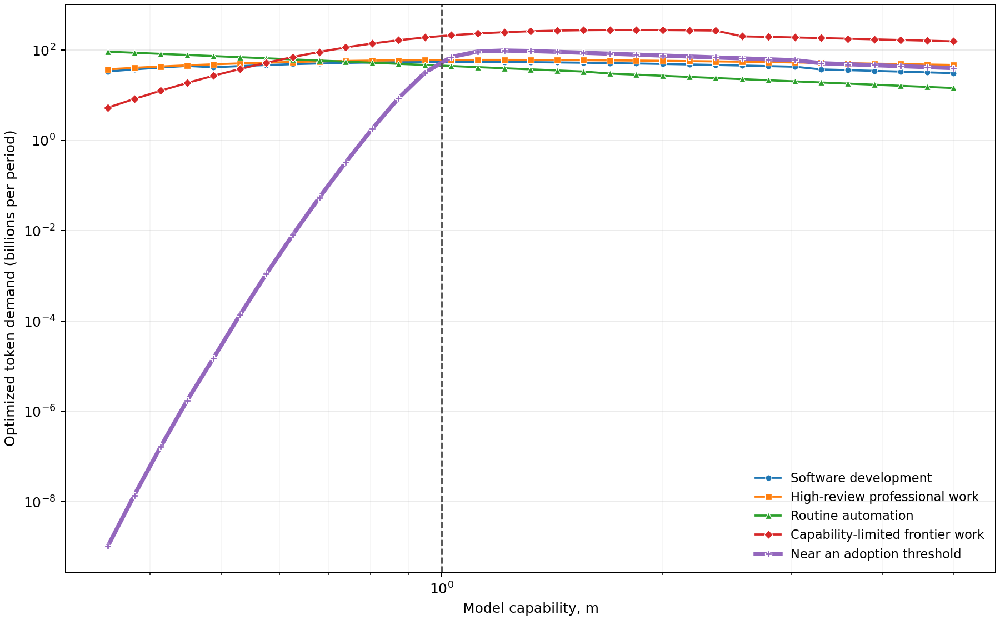
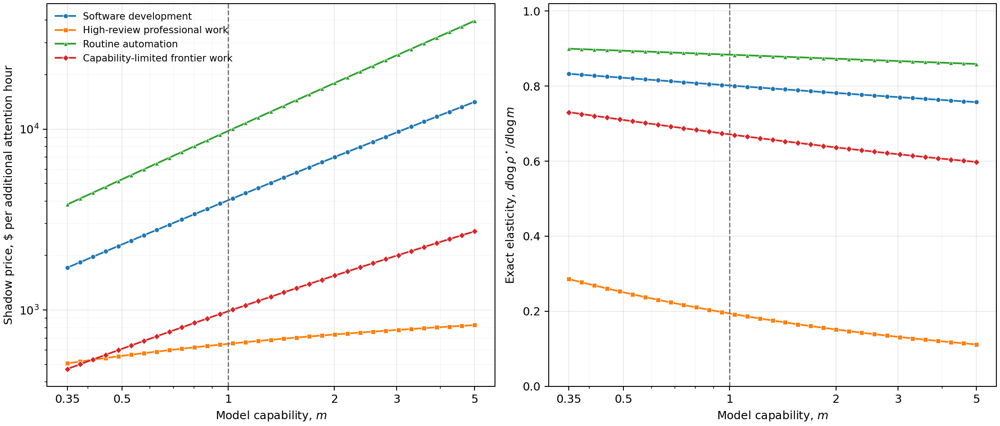
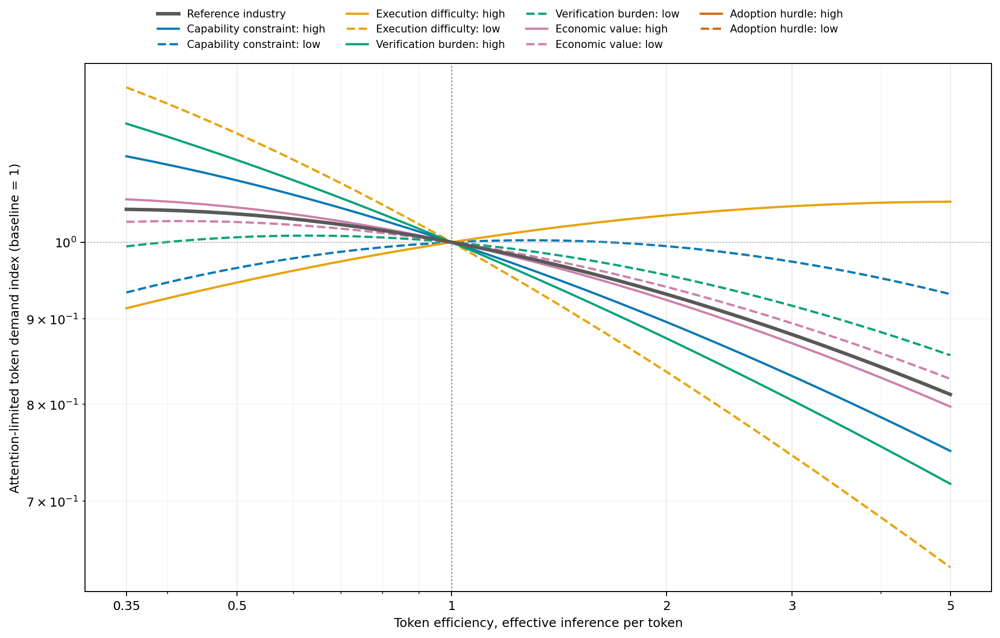
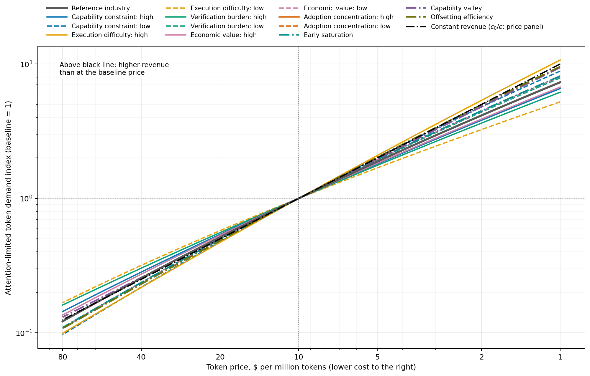
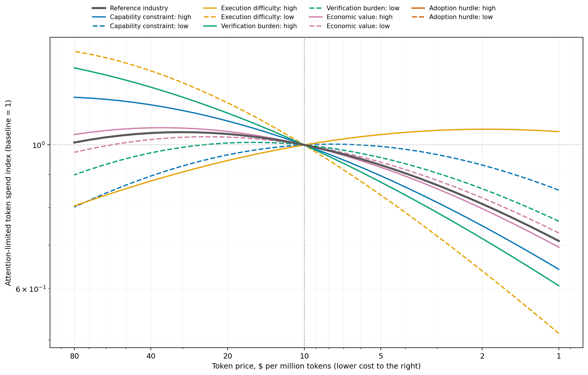
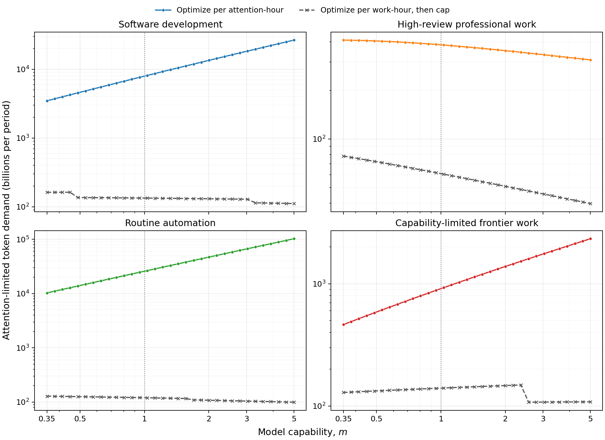
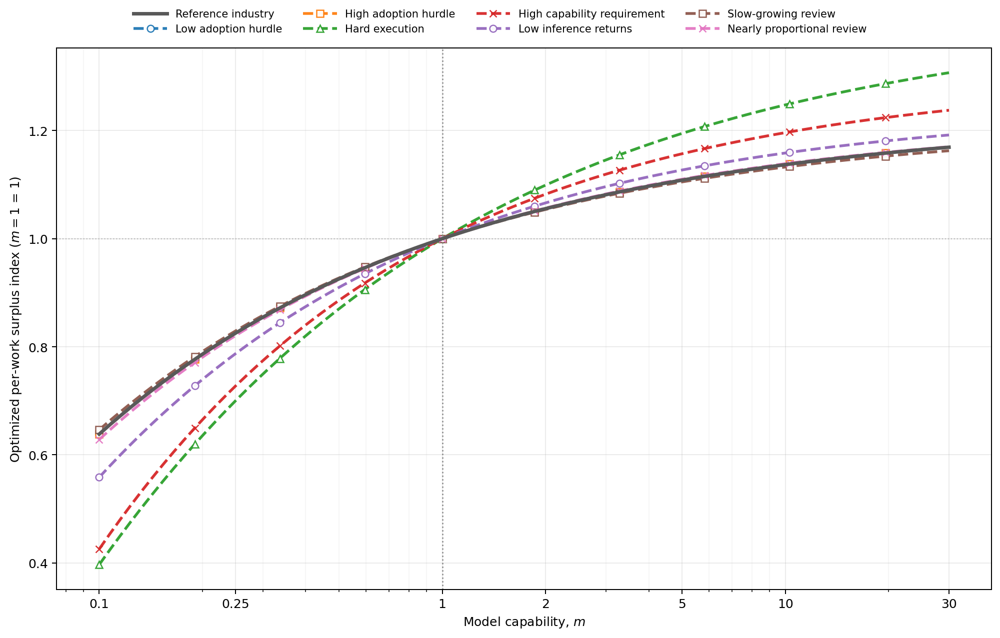

# Modeling Token Demand

## Delegation, inference, retries, and scarce human attention

**Working draft**

## Abstract

A common forecast of future inference demand begins with a large pool of economic activity, such as aggregate labor income or corporate spending, and assumes that sufficiently capable models will capture some fraction of it. Such calculations can describe a potential market, but they do not explain the behavior that turns model progress into token purchases. In particular, they often leave implicit how much work a model can actually complete, how often execution fails, and how much human attention is still required to specify, guide, and verify the work.

We instead model inference demand from the user's interaction policy. A user chooses how much work to delegate before the next checkpoint, how many tokens to spend on each attempt, and how many attempts to allow. The model does not assume that an entire job or unit of work becomes automatable. It separates whether a task lies inside the model's capability frontier from whether one attempt executes a solvable task successfully, and it makes human verification an explicit resource. We characterize the resulting demand when available work is scarce, when human attention is scarce, and when both resources can bind.

The constraint determines the result. With fixed work, a finite retry cap can be optimal. With abundant interchangeable work and scarce attention, one attempt weakly dominates retries. A uniform reduction in verification time increases attention-limited token demand in exact inverse proportion and leaves the optimal interaction policy unchanged. Greater model capability raises the optimized value of scarce attention, with an elasticity determined by how verification scales with delegated scope. Token demand itself remains ambiguous: it rises only when greater adoption or supervisory leverage outweighs lower token use per unit of work.

## 1. Introduction

Many top-down forecasts start with an aggregate pool of wages, profits, or corporate spending and ask what fraction a capable AI system might capture. This approach can provide an upper bound on economic value, but it does not provide a demand curve for inference. It does not say which parts of the underlying work are feasible, how many attempts the work requires, how token use changes with delegated scope, or how much human attention is needed to keep the process moving.

Forecasting inference demand therefore requires more than estimating how many tokens a model uses on today's tasks. That calculation holds the user's interaction policy fixed. A user can instead respond to a better or cheaper model by changing the scope of delegated work, the inference devoted to each attempt, and the number of attempts made before abandoning a task. These choices determine both tokens per unit of work and the amount of work that can be supervised.

This creates a basic ambiguity. Model progress reduces the cost of producing a given result. The same progress can make larger delegated tasks worthwhile, move more work onto AI systems, and increase the amount of machine work supported by a fixed human review budget. A useful model of token demand must represent both effects within the same decision problem.

We study an industry-level user who chooses an interaction policy with three components:

- a delegation horizon, which is the amount of work assigned before the next human checkpoint;
- inference intensity, which is the number of tokens used per unit of delegated work in each attempt; and
- a retry cap, which is the maximum number of attempts allowed for one delegated chunk.

In practical systems, inference intensity corresponds to the amount of computation allocated to an attempt. In ChatGPT, it is similar to choosing a reasoning-effort setting such as low, medium, high, or xhigh; a higher-compute mode such as Pro is another example of moving along this margin. Choosing among smaller and larger models in the same family can also be represented through $x$ after converting raw tokens to a common compute-equivalent unit, so that one token from a larger model counts as multiple smaller-model-token equivalents. Any remaining difference in the set of tasks the models can solve belongs in capability $m$, while differences in effective inference per compute-equivalent token belong in efficiency $\eta$.

The analysis proceeds in the order needed to determine demand. Section 2 defines the policy, the capability and execution model, retry behavior, verification, and surplus. Section 3 derives optimal policies and token demand under a work constraint, an attention constraint, and both constraints together, taking technology and prices as given. Section 4 examines how those choices and demand respond to changes in capability, efficiency, token prices, and verification. Section 5 illustrates these responses numerically. The numerical exercise is designed to expose model mechanisms; it is not an empirical forecast.

The main results are as follows. First, separating capability from execution prevents pass rates from converging mechanically to one and makes the value of retries depend on the unsolvable share of work. Second, the resource constraint changes the policy objective. Applying an attention cap after optimizing surplus per unit of work generally does not recover the attention-constrained solution. Third, when useful tasks are abundant and interchangeable, retrying a failed task cannot improve expected value per scarce verification hour. Fourth, model capability can raise the value of an additional attention hour even when optimized token demand falls. These results identify the objects that must be estimated before aggregate token demand can be forecast.

## 2. Model

Industries are indexed by $i\in\mathcal I$. One unit of underlying work is measured in human-hour-equivalents. The unit fixes the scale of the model; it does not assume that a human must perform the work.

### 2.1 Interaction policy and technology

A user in industry $i$ chooses a policy $(s,x,k)$:

- $s>0$ is the **delegation horizon**, measured in units of underlying work between human checkpoints;
- $x>0$ is **inference intensity**, measured in tokens per unit of work in one attempt; and
- $k\in\mathbb N$ is the maximum number of attempts allowed for one delegated chunk.

One attempt on a chunk of size $s$ consumes

```math
T(s,x)=sx
```

tokens. Increasing $s$ changes the scope of work assigned between checkpoints. Increasing $x$ changes the computation devoted to each unit of that work. The distinction is important because a model can support longer delegation without requiring the same proportional increase in tokens per unit of work.

Four scenario variables describe technology and cost. Model capability is $m>0$, token efficiency is $\eta>0$, the price of one token is $c>0$, and the verification-time multiplier is $v>0$. A larger $\eta$ means that each token produces more effective inference. The constant $x_{\mathrm{ref}}>0$ is a numerical reference level used only to make inference intensity dimensionless inside the execution function.

### 2.2 Capability and execution

A failed attempt can have two different causes. The task may be outside the model's capability frontier, or the task may be solvable but poorly executed on that attempt. The model represents these events separately.

The share of tasks of horizon $s$ that lie inside industry $i$'s capability frontier is

```math
q_i(s;m)
=
\exp\left[-\left(\frac{s}{\lambda_i m}\right)^{\nu_i}\right].
```

The parameter $\lambda_i>0$ sets the horizon at which capability begins to bind, and $\nu_i>0$ controls how sharply the solvable share falls with delegated scope. Greater capability shifts the frontier outward.

Conditional on a task being solvable, one attempt succeeds with probability

```math
r_i(s,x;m,\eta)
=
\exp\left[
-\frac{s}
{a_i m\left[\eta(x/x_{\mathrm{ref}})\right]^{\alpha_i}}
\right].
```

The parameter $a_i>0$ measures execution ease. The parameter $0<\alpha_i<1$ gives diminishing returns to inference intensity. Conditional reliability falls with the delegation horizon and rises with capability, token efficiency, and inference intensity. The unconditional success probability of the first attempt is $q_i r_i$.

Capability and token efficiency play different roles. Capability $m$ expands the solvable set through $q_i$ and improves execution through $r_i$. Token efficiency $\eta$ changes how much effective inference is obtained from a token, but it does not directly move the capability frontier.

### 2.3 Bounded retries

Suppose attempts on a solvable task explore independent execution paths, each of which succeeds with probability $r_i$. The user stops after the first success or after $k$ failures. The probability of success within $k$ attempts is

```math
P_i(s,x,k;m,\eta)
=
q_i\left[1-(1-r_i)^k\right].
```

Therefore

```math
\lim_{k\rightarrow\infty}P_i=q_i.
```

Retries can repair execution failures, but they cannot move a task into the solvable set.

The expected number of attempts consumed by one delegated chunk is

```math
E_i(s,x,k;m,\eta)
=
(1-q_i)k
+q_i\frac{1-(1-r_i)^k}{r_i}.
```

The first term covers tasks outside the capability frontier, which consume all $k$ attempts. The second term is the truncated geometric expectation for solvable tasks. At $k=1$, exactly one attempt is consumed, so $E_i=1$. Expected token use per chunk is

```math
T_i^{\mathrm{exp}}=sxE_i.
```

The independence assumption is a minimal specification. An empirical pass-at-$k$ curve can replace it without changing the resource constraints or demand accounting below.

### 2.4 Verification, value, and surplus

Human verification time after one attempt is

```math
h_i(s;v)
=
v\left(h_{0,i}+h_{1,i}s^{\beta_i}\right).
```

Here $h_{0,i}\geq0$ is fixed checkpoint overhead, $h_{1,i}>0$ scales review that grows with delegated scope, and $\beta_i\geq0$ is the elasticity parameter governing that growth. The multiplier $v$ changes the level of verification time without changing its shape.

Let $b_i>0$ be the value of successfully completing one unit of work, and let $w_i>0$ be the opportunity cost of one hour of human attention. For a single attempt, token and verification cost per unit of delegated work are

```math
C_i(s,x;v)
=
cx+w_i\frac{h_i(s;v)}{s}.
```

Expected surplus per unit of work under policy $(s,x,k)$ is

```math
u_i(s,x,k)
=
b_iP_i(s,x,k)
-E_i(s,x,k)C_i(s,x;v).
```

Equivalently, a delegated chunk creates expected surplus $s u_i$. This is the common economic object used in each constraint regime. What changes across regimes is the resource against which that surplus is maximized.

## 3. User behavior under alternative constraints

This section holds technology and prices fixed and derives the policy and token demand implied by each resource constraint. Section 4 then changes technology or prices and compares the resulting optimal choices.

### 3.1 Limited work, nonbinding attention

First suppose industry $i$ has a fixed pool of potential work and enough human attention to review all economically adopted work. The user chooses

```math
(s_i^W,x_i^W,k_i^W)
\in
\arg\max_{s>0,\,x>0,\,k\in\mathbb N}
u_i(s,x,k).
```

Write $u_i^W$ for the optimized AI surplus. Adoption compares this surplus with the current alternative for each unit of work.

Assume that the minimum AI surplus $\phi$ required for a unit of work to switch is distributed logistically across work, with location $\mu_i$ and scale $\sigma_i>0$. This threshold can incorporate the surplus from human-only production together with switching, integration, and risk costs. The adoption share is therefore

```math
A_i
=
\Pr(\phi\leq u_i^W)
=
\frac{1}{1+\exp[-(u_i^W-\mu_i)/\sigma_i]},
```

where $\mu_i$ is the surplus at which half of potential work is adopted and $\sigma_i$ controls how gradually work switches to AI. More generally, write $A_i(s,x,k)$ for the same logistic expression evaluated at the candidate surplus $u_i(s,x,k)$.

#### Result 1: work-limited demand depends on adoption and tokens per unit of work

Token demand equals the amount of work adopted multiplied by expected tokens per unit of work. Let $W_i>0$ be potential work during the period. The number of adopted chunks is $W_iA_i/s_i^W$. Each chunk consumes $s_i^Wx_i^WE_i^W$ expected tokens. Work-limited token demand is therefore

```math
D_i^W
=
W_iA_ix_i^WE_i^W.
```

The delegation horizon cancels from this accounting identity. Grouping a fixed amount of work into larger chunks does not mechanically create more work. The horizon still matters because it changes capability, reliability, verification, retries, inference intensity, and adoption.

#### Result 2: retries can be worthwhile, but the optimal cap is finite

For fixed $(s,x)$, the decision after a failure is local: the user should make one more attempt only when its conditional expected benefit exceeds its cost. The relevant success probability changes after every failure because failure is evidence that the task may be outside the capability frontier.

Write $P_{i,k}=q_i[1-(1-r_i)^k]$. After the first $k$ attempts fail, the posterior probability that the task is solvable is

```math
\widehat q_{i,k}
:=
\Pr(\text{solvable}\mid k\text{ failures})
=
\frac{q_i(1-r_i)^k}{1-P_{i,k}}.
```

The conditional probability that the next attempt succeeds is therefore $\widehat q_{i,k}r_i$. At the decision point, one more attempt is worthwhile if and only if

```math
b_i\widehat q_{i,k}r_i
>
C_i(s,x;v).
```

At $k=0$, the posterior equals the prior, so the rule for starting a fresh task is $b_iq_ir_i>C_i$. After failures, $\widehat q_{i,k}<q_i$ whenever $q_i<1$. Multiplying the local condition by the probability $1-P_{i,k}$ of reaching the decision point gives

```math
b_iq_ir_i(1-r_i)^k
>
(1-P_{i,k})C_i(s,x;v).
```

This is also the ex ante comparison between retry caps $k$ and $k+1$, because

```math
P_{i,k+1}-P_{i,k}
=
q_ir_i(1-r_i)^k.
```

When $b_ir_i>C_i$ and $q_i<1$, either form of the condition is equivalent to

```math
(1-r_i)^k
>
\frac{C_i(1-q_i)}{q_i(b_ir_i-C_i)}.
```

The right side is positive whenever some tasks are unsolvable, while the left side tends to zero as $k$ grows. The inequality must therefore eventually fail. If it holds at $k=1$, allowing a second attempt improves surplus over stopping after one. Once it fails, the posterior solvable probability only falls further, so no later retry becomes worthwhile at the same $(s,x)$.

#### Optimal inference and delegation

For a fixed retry cap, an interior inference choice satisfies

```math
b_iP_{i,x}
=
E_{i,x}C_i+E_ic,
```

where a subscript denotes a partial derivative. The left side is the marginal value of more inference. The right side includes its direct token cost and its effect on the expected number of attempts.

An interior delegation choice satisfies

```math
b_iP_{i,s}
=
E_{i,s}C_i
+E_iw_i\frac{s h_{i,s}-h_i}{s^2}.
```

For $h_i(s;v)=v(h_{0,i}+h_{1,i}s^{\beta_i})$ with $\beta_i\leq1$,

```math
s h_{i,s}-h_i
=
-v\left[h_{0,i}+(1-\beta_i)h_{1,i}s^{\beta_i}\right]
\leq0.
```

Longer chunks therefore reduce verification cost per unit of work, while capability and execution reliability move in the opposite direction. The optimal horizon balances these forces.

### 3.2 Limited attention, abundant work

Now suppose useful work is abundant and interchangeable, but only $H_i>0$ human verification hours are available during the period. Let $N_i\geq0$ be the number of delegated chunks. The user solves

```math
\max_{s,x,k,N_i\geq0}
N_i s u_i(s,x,k)
```

subject to

```math
N_iE_i(s,x,k)h_i(s;v)\leq H_i.
```

If operating creates positive value and attention binds, then

```math
N_i
=
\frac{H_i}{E_i(s,x,k)h_i(s;v)}.
```

Substitution gives the policy objective

```math
J_i(s,x,k)
=
\frac{s u_i(s,x,k)}{E_i(s,x,k)h_i(s;v)}
=
\frac{s}{h_i(s;v)}
\left[
\frac{b_iP_i(s,x,k)}{E_i(s,x,k)}-cx
\right]
-w_i.
```

Thus the attention-constrained policy is

```math
(s_i^H,x_i^H,k_i^H)
\in
\arg\max_{s>0,\,x>0,\,k\in\mathbb N}J_i(s,x,k).
```

The attention endowment $H_i$ scales activity but does not change this policy in the single-industry polar case. The opportunity cost $w_i$ enters as a constant. It determines participation but does not change the maximizing policy once attention binds.

#### Result 3: retries do not improve value per scarce attention hour

For any fixed $(s,x)$,

```math
\frac{P_{i,k}}{E_{i,k}}
\leq
q_ir_i
=
\frac{P_{i,1}}{E_{i,1}}.
```

The inequality follows from $1-(1-r_i)^k\leq kr_i$. The token-cost term in $J_i$ does not depend on $k$, because both expected token use and expected verification time scale with $E_i$. Therefore $k=1$ weakly dominates every larger retry cap.

The result depends on abundant interchangeable work. After a failure, beginning a fresh task draws again from the original capability distribution, while retrying the same task conditions on evidence that it may lie outside the capability frontier. Retries can return when work is finite, abandonment destroys value, tasks differ in value, later attempts learn from earlier failures, or setup costs can be reused.

#### Result 4: attention-limited demand depends on supervisory leverage

The industry attempts $H_i/[E_i^Hh_i(s_i^H;v)]$ chunks. Multiplying by expected tokens per chunk gives

```math
D_i^H
=
H_i\frac{s_i^Hx_i^H}{h_i(s_i^H;v)}.
```

Expected attempts cancel from demand because each additional attempt consumes both another token budget and another checkpoint. Demand per human attention hour is

```math
\frac{D_i^H}{H_i}
=
\underbrace{\frac{s_i^H}{h_i(s_i^H;v)}}_
{\text{work launched per attention hour}}
\times
\underbrace{x_i^H}_
{\text{tokens per unit of work}}.
```

This decomposition isolates the attention channel: a fixed human attention budget supports token use through both the work launched per attention hour and the inference devoted to each unit of work.

### 3.3 Work and attention can both bind

The two polar cases isolate the mechanisms, but they generally imply different policies. It is therefore incorrect to optimize surplus per unit of work and then apply an attention cap when attention changes the user's choices.

For a candidate policy, the maximum feasible number of chunks is

```math
N_i(s,x,k)
=
\min\left\{
\frac{W_iA_i(s,x,k)}{s},
\frac{H_i}{E_i(s,x,k)h_i(s;v)}
\right\}.
```

The joint problem is

```math
\max_{s,x,k,N_i\geq0}
N_i s u_i(s,x,k)
```

subject to

```math
N_i s
\leq
W_iA_i(s,x,k),
\qquad
N_iE_i(s,x,k)h_i(s;v)
\leq
H_i.
```

After solving this problem, token demand is

```math
D_i=N_i^*s_i^*x_i^*E_i^*.
```

The work-limited and attention-limited models are the two cases in which one of the capacity constraints is slack. Aggregate demand is

```math
D=\sum_{i\in\mathcal I}D_i.
```

## 4. How technology and prices affect token demand

Section 3 derived the user's policy for given technology and prices. Here we change one input at a time, hold the other inputs and resource endowments fixed, and compare outcomes after the user chooses a new optimal policy. These comparisons do not model how quickly users adjust.

The model gives strong conclusions about feasibility and optimized value. It gives weaker conclusions about token demand because users can change delegation, inference intensity, retries, and adoption.

| Change | Guaranteed effect at a fixed policy or effective inference level | Effect on optimized token demand |
|---|---|---|
| Capability $m\uparrow$ | $q_i$ and $r_i$ rise; $P_i$ rises and $E_i$ falls | Ambiguous |
| Token efficiency $\eta\uparrow$ | The same effective inference can be produced with fewer tokens; optimized surplus cannot fall | Ambiguous |
| Token price $c\downarrow$ | The feasible set is unchanged and optimized surplus cannot fall | Token quantity weakly rises in either pure regime under the standard revealed-preference comparison; spend is ambiguous |
| Verification multiplier $v\downarrow$ | Verification uses less human time; optimized surplus cannot fall | Exactly proportional to $1/v$ in the pure attention-limited regime; otherwise policy-dependent |

### 4.1 Model capability

For every fixed policy, greater $m$ raises the solvable share $q_i$ and conditional success $r_i$. It therefore raises eventual success $P_i$ and reduces expected attempts $E_i$. The user can respond by choosing a longer horizon, less inference per unit of work, or a different retry cap.

#### Result 5: capability raises the value of scarce attention

Define gross value per verification hour, after token spending but before subtracting $w_i$, as

```math
R_i(s,x,k)
=
J_i(s,x,k)+w_i.
```

Its optimized value is

```math
\rho_i^*(m)
=
\max\left\{0,\max_{s,x,k}R_i(s,x,k;m)\right\}.
```

If $h_{0,i}>0$, $0\leq\beta_i\leq1$, $\rho_i^*>0$, and the attention-constrained solution is interior, then $k_i^H=1$ and, holding $c$, $\eta$, and $v$ fixed, the capability elasticity of the optimized gross value is

```math
\frac{d\log\rho_i^*}{d\log m}
=
1-\theta_i(s_i^H),
```

where

```math
\theta_i(s)
:=
\frac{s h_{i,s}(s;v)}{h_i(s;v)}
=
\frac{\beta_i h_{1,i}s^{\beta_i}}
{h_{0,i}+h_{1,i}s^{\beta_i}}.
```

Since $0\leq\theta_i(s)\leq\beta_i$, the elasticity lies between $1-\beta_i$ and $1$. Capability is most valuable at the margin when verification grows slowly with delegated scope.

#### The effect on token demand remains ambiguous

The value result does not determine token use: $\rho_i^*$ can rise while $D_i^H$ falls if the user reduces $x_i^H$ sufficiently. The two resource regimes make the relevant tradeoffs clear.

In the work-limited regime,

```math
D_i^W=W_iA_ix_i^WE_i^W.
```

Demand rises when adoption grows faster than inference intensity and expected attempts fall. Once adoption is saturated, the reduction in $x_i^WE_i^W$ can dominate.

In the attention-limited regime,

```math
D_i^H=H_i\frac{s_i^H}{h_i(s_i^H;v)}x_i^H.
```

Demand rises when capability expands supervisory leverage $s_i^H/h_i(s_i^H;v)$ faster than chosen inference intensity falls. The elasticity result for $\rho_i^*$ shows why low verification elasticity makes capability economically valuable, while the demand equation shows why that fact alone does not determine token use.

### 4.2 Token efficiency

Let effective inference intensity be $z=\eta x$. Holding $z$ fixed, a rise in $\eta$ allows the user to set $x=z/\eta$. Capability, reliability, and expected attempts are unchanged, while token cost falls. Optimized surplus therefore cannot decrease.

Token demand may increase through adoption or a longer delegation horizon. In the attention-limited regime,

```math
\frac{d\log D_i^H}{d\log\eta}
=
\frac{d\log[s_i^H/h_i(s_i^H;v)]}{d\log\eta}
+
\frac{d\log x_i^H}{d\log\eta}.
```

A Jevons-style increase in token use occurs only when the growth in supervisory leverage is larger than the decline in token intensity. In the work-limited regime, the corresponding extensive margin is adoption $A_i$.

### 4.3 Token price and token spend

A lower token price is a movement along the token demand curve. In either pure regime, the feasible set is fixed, so revealed preference implies that the optimized token quantity is weakly higher at a lower price. This result does not determine spending.

Let

```math
S(c)=cD(c)
```

be token spend. Spend rises after a price reduction only when token demand increases more than proportionally:

```math
\frac{d\log D}{d\log c}<-1.
```

Price and efficiency answer different questions. A lower $c$ changes the budget tradeoff for the same token technology. A larger $\eta$ changes the amount of effective inference produced by each token.

### 4.4 Verification technology

The level and shape of verification have different effects. A change in $v$ multiplies all verification time by the same factor.

#### Result 6: uniformly faster verification scales up attention-limited demand

If verification takes half as long, the same attention budget supports twice as many tokens without changing the optimal policy, provided attention binds in both cases. In the pure attention-limited regime,

```math
J_i(s,x,k;v)
=
\frac{1}{v}R_i(s,x,k;1)-w_i.
```

The factor $1/v$ does not change the maximizing policy. Consequently,

```math
D_i^H(v)
=
\frac{1}{v}D_i^H(1).
```

This exact result applies only when useful work is abundant and attention is the binding constraint at both values of $v$. In the work-limited or joint problem, lower verification time changes per-unit cost, adoption, and the optimal policy.

#### Changes in how verification scales with scope

Changing $\beta_i$ is different. It changes how verification scales with the delegation horizon, alters the policy itself, and changes both supervisory leverage and the capability elasticity of scarce attention.

## 5. Numerical illustrations

The numerical exercise solves four parameter regimes that differ in capability, execution, and verification. The labels describe those parameter differences; they are not empirical industry estimates. At every point, the optimizer enumerates the retry cap and reoptimizes delegation and inference intensity.

The primary figures use the abundant-work, binding-attention regime with 100,000 verification hours per parameter regime. This normalization scales demand without changing the optimized policy or the shape of the curves. The numerical results confirm four features of the analysis:

1. The attention-constrained optimizer selects $k=1$ throughout the price, efficiency, and capability sweeps, as Result 3 predicts.
2. Capability raises the shadow value of attention in every regime, while token demand can rise or fall depending on verification elasticity and the response of inference intensity.
3. Higher token efficiency usually lowers token demand, but a sufficiently strong increase in supervisory leverage can produce an intermediate rebound.
4. Optimizing surplus per unit of work and then applying an attention cap can produce a substantially different policy and demand path from solving the attention-constrained problem directly.















The [analysis notebook](notebooks/comparative_statics.ipynb) records the parameter values, numerical bounds, optimizer checks, and figure-generation code.

## 6. Measurement and limitations

The model separates the empirical objects needed for a forecast:

1. **Capability:** estimate $q_i(s;m)$ over task horizons and model versions.
2. **Execution:** estimate $r_i(s,x;m,\eta)$ and empirical pass-at-$k$ curves.
3. **Verification:** estimate $h_i(s;v)$, including its fixed cost and elasticity with respect to delegated scope.
4. **Value and cost:** estimate $b_i$, $w_i$, and the location $\mu_i$ and scale $\sigma_i$ of adoption thresholds.
5. **Available resources:** measure potential work $W_i$ and human attention $H_i$ to determine which constraint binds.
6. **Behavior:** observe the chosen $(s,x,k)$ together with success, review time, repair time, abandonment, and final acceptance.

Tokens per completed task are not sufficient. They combine policy, task selection, reliability, retries, and the binding resource constraint.

The current specification has several limitations. Attempts are conditionally independent within the solvable set. Verification is perfect and occurs after every attempt. Work within an industry has a common value apart from its reduced-form adoption hurdle. The model does not include learning across attempts, reusable setup costs, parallel attempts, latency, model routing, or a distinction among input, cached, reasoning, and output tokens. The joint work-and-attention problem is stated above, while the current numerical notebook focuses on the two polar objectives. These extensions should be introduced when data can identify them.

## 7. Conclusion

Token demand is the result of an optimized interaction policy. Users choose delegated scope, inference intensity, and retries subject to the resource that constrains activity. The same model improvement can therefore reduce tokens per unit of fixed work while increasing adoption or the amount of work supported by scarce human attention.

The constraint must be part of the optimization problem. With fixed work, retries can be valuable and demand depends on adoption and tokens per unit. With abundant work and scarce attention, retries are weakly dominated and demand factors into supervisory leverage and inference intensity. When both work and attention can bind, policy and throughput must be solved jointly. This sequence turns the apparent ambiguity of token demand into a set of measurable economic questions.

## Appendix A. Notation

| Symbol | Definition |
|---|---|
| $\mathcal I$, $i$ | Set of industries and industry index |
| $s$ | Delegation horizon: units of work per checkpoint |
| $x$ | Tokens per unit of work in one attempt |
| $k$ | Maximum attempts per delegated chunk |
| $N_i$ | Number of delegated chunks during the period |
| $m$ | Model capability |
| $\eta$ | Effective inference per token |
| $c$ | Price per token |
| $v$ | Multiplicative verification-time factor |
| $x_{\mathrm{ref}}$ | Reference token intensity used to normalize the execution function |
| $\lambda_i$, $\nu_i$ | Scale and shape of the capability frontier |
| $a_i$, $\alpha_i$ | Execution scale and inference-return elasticity |
| $q_i$ | Share of tasks inside the capability frontier |
| $\widehat q_{i,k}$ | Posterior probability that a task is solvable after $k$ failed attempts |
| $r_i$ | One-attempt success probability conditional on solvability |
| $P_i$ | Success probability within $k$ attempts |
| $E_i$ | Expected attempts consumed |
| $h_{0,i}$, $h_{1,i}$, $\beta_i$ | Fixed verification time, variable verification scale, and verification elasticity parameter |
| $h_i$ | Verification hours per attempt |
| $b_i$ | Value per successfully completed unit of work |
| $w_i$ | Opportunity cost per human attention hour |
| $C_i$ | Attempt cost per unit of delegated work |
| $u_i$ | Expected surplus per unit of work |
| $J_i$ | Expected net surplus per human verification hour |
| $R_i$ | Gross value per verification hour before subtracting $w_i$ |
| $\rho_i^*$ | Optimized gross value of an additional verification hour |
| $\theta_i$ | Elasticity of verification time with respect to delegated scope |
| $\phi$ | Minimum AI surplus required for a unit of work to switch from its current alternative |
| $\mu_i$, $\sigma_i$ | Location and scale of the logistic distribution of adoption thresholds |
| $A_i$ | Share of potential work assigned to AI |
| $W_i$ | Potential units of work during the period |
| $H_i$ | Human verification hours available during the period |
| $D_i^W$, $D_i^H$, $D_i$ | Work-limited, attention-limited, and joint token demand |
| $D$ | Aggregate token demand |
| $S(c)$ | Aggregate token spend at price $c$ |

A superscript $W$ denotes the work-limited solution, a superscript $H$ denotes the attention-limited solution, and a star denotes the solution to the applicable optimization problem. Subscripts $s$ and $x$ on a function denote partial derivatives.

## Appendix B. Numerical implementation

The code separates the economic model from the numerical optimizer:

- `Industry` contains capability, execution, verification, value, adoption, and capacity parameters.
- `Scenario` contains $m$, $\eta$, $c$, and $v$.
- `Policy` contains $(s,x,k)$, while `PolicyOutcome` records the implied reliability, surplus, adoption, and token demand.
- `IndustryModel` evaluates a candidate policy without choosing it.
- `PolicyOptimizer` maximizes $u_i$ for the work-limited polar case.
- `AttentionConstrainedOptimizer` maximizes $J_i$ for the attention-limited polar case. It also implements the exact one-dimensional interior characterization used to verify the capability result.

```python
from modeling_token_demand import (
    AttentionConstrainedOptimizer,
    IndustryModel,
    PolicyOptimizer,
    Scenario,
)
from modeling_token_demand.calibrations import SUBLINEAR_VERIFICATION

model = IndustryModel(SUBLINEAR_VERIFICATION)
scenario = Scenario(
    model_capability=1.0,
    token_efficiency=1.0,
    token_price_per_million=10.0,
)

work_limited = PolicyOptimizer().solve(model, scenario)
attention_limited = AttentionConstrainedOptimizer().solve(model, scenario)
```

The package measures $x$ and demand in tokens. `token_reference` is the code parameter corresponding to $x_{\mathrm{ref}}$ and is only a normalization inside the execution function.

Run the checks and notebook with

```bash
uv sync --extra notebook --extra dev
uv run pytest
uv run jupyter lab notebooks/comparative_statics.ipynb
```
