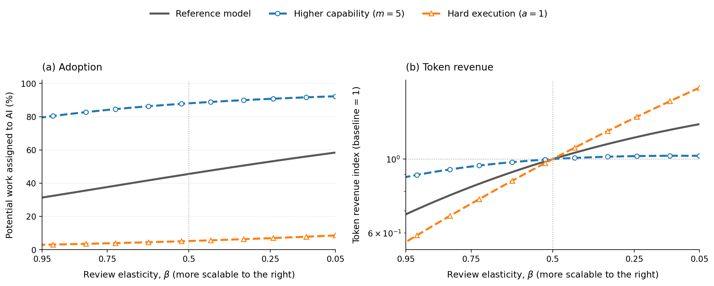
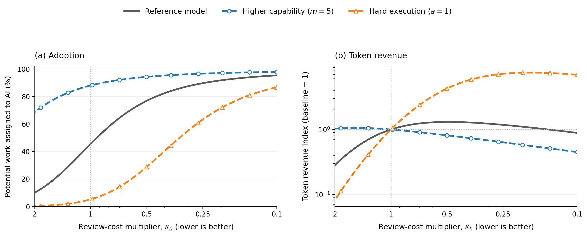
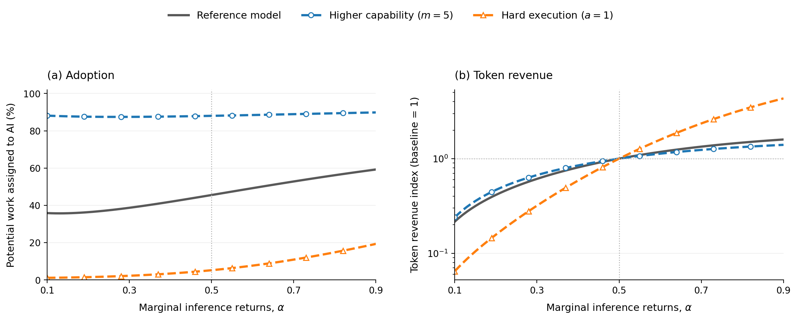

# Modeling Token Demand

## 1. Modeling assumptions

### 1.1 The user chooses scope and effort level

For each task, the user chooses two things:

- $s$: the scope of the task as measured in work units. A work unit can be thought of as the work a reference human completes in one hour. "Implement this function" would be a relatively small task, while "Refactor this entire system and ensure the test coverage is good" would be a large task.
- $x$: model's effort level. This is measured in a normalized token unit. i.e. higher x means model tries harder on a given task. Given a task with scope $s$ we assume the model spends $sx$ number of normalized tokens. One can think of $x$ is the "low, medium, high, pro, ultra" settings one have in ChatGPT for example.

After the model attempts each task, the user needs to verify the correctness of its output. All else being equal, the bigger the task, the less reliable the model is. On the other hand, assigning bigger tasks reduces the number of times the user has to manually review the model's output. For example, one can use AI in "tab complete" mode, where each task is simply to complete the next line of code. In this case, the success rate is likely very high and each verification step is quick, but the workflow requires many human verification steps over the course of a day. The other extreme is to assign the AI an entire project. This reduces the number of human verification steps, but each step takes longer, and the AI is much less likely to complete the work correctly.

For more difficult tasks, higher $x$ can significantly increase the success probability. For easy tasks, however, a large $x$ unnecessarily increases token usage without meaningfully improving the quality of the output.

The user chooses the optimal $s$ and $x$ to maximize their utility, which will be made explicitly shortly.

### 1.2 Model capability expands the set of feasible tasks

Let $m$ denote model capability. The share of tasks within the model's capability frontier is given by

```math
q(s;m)=\exp\left[-\left(\frac{s}{\lambda m}\right)^\nu\right],
```

where the parameters $\lambda$ and $\nu$ together define how *difficult* the set of possible tasks is. Different industries have different $\lambda$ and $\nu$. Given a fixed model capability $m$ and task scope $s$, $q(s;m)$ is the fraction of work in the industry that is feasible for the model.

Note that feasibility does not imply a 100% success rate, which we model next.

### 1.3 More tokens spent = higher probability of success

Conditional on a task being feasible, we model the probability of successful execution as

```math
r(s,x;m,\eta)
=\exp\left[-\frac{s}{a m(\eta x)^\alpha}\right].
```

The parameter $\alpha\in(0,1)$ determines the rate of diminishing returns to more inference. $\eta$ measures token efficiency: a model that is twice as token-efficient can achieve the same reliability, or success rate, with half as many tokens. We model token efficiency separately from model capability because capability expands the set of feasible tasks, whereas token efficiency does not. It is common practice for labs to publish model evaluation results on a reward vs tokens plot. Pushing the curve horizontally towards fewer tokens means the token efficiency is improving. Pushing the curve up means the capability ceiling is improving. 

Combined with the task feasibility set, a model can successfully complete a task with scope $s$ with probability

```math
P(s,x;m,\eta)=q(s;m)r(s,x;m,\eta).
```

### 1.4 Human reviews take longer as tasks get larger

We model the review time for one task as

```math
h(s)=h_0+h_1\left[(1+s)^\beta-1\right].
```

$h_0$ is the fixed time associated with one review. The second term grows with assignment size. Depending on the type of workflow, $\beta$ can be small, which means that human verification time is nearly fixed with respect to task horizon $s$. When $\beta$ is close to one, review grows almost in proportion to the work delegated. As $\beta$ approaches 0 the review cost approaches $h_0$, and as $\beta$ approaches 1 the review cost approaches $h_0 + h_1s$


Examples of workflows with small $\beta$ include software engineering work with automated tests and reliable benchmarks. Examples with large $\beta$ include insurance claims and legal cases, where each case still requires human supervision and the amount of human verification work grows nearly linearly with the task scope. 

Let $w$ be the dollar value of one hour of human attention. Review cost per unit of work is

```math
w\frac{h(s)}s.
```

### 1.5 The user maximizes expected surplus

Let $b$ be the value of one successfully completed work unit. Let $c$ be the dollar price of one normalized token unit. Expected surplus per assigned work unit is

```math
u(s,x)=bP(s,x;m,\eta)-cx-w\frac{h(s)}s.
```

Given a fixed set of model and industry parameters, let $s^*$ and $x^*$ be the scope and model-effort settings that maximize the user's surplus per work unit.

### 1.6 Adoption depends on the value of using AI

A positive optimized surplus, $u^*:=u(s^*,x^*)>0$, does not by itself guarantee that the user will adopt AI. This could be because completing the work manually generates even more surplus, or it could be due to inherent frictions in adopting a new technology. Conversely, some users may adopt even when measured surplus is negative because they value being AI-forward or has an organizational mandate to use AI. We capture these considerations with an adoption hurdle $\phi$, which can be positive or negative and is distributed logistically across tasks. A user adopts when surplus exceeds this hurdle. The fraction of work that adopts AI given some surplus is then given by

```math
A(u)=\Pr(\phi\leq u)=\frac{1}{1+\exp[-(u-\mu)/\sigma]}.
```

The location $\mu$ sets the typical hurdle. The spread $\sigma$ determines whether adoption is gradual or concentrated around a threshold.

### 1.7 Token revenue is proportional to number of tokens used

Let $Q$ be the number of work units assigned to AI during the period. Then

```math
D=Qx
```

is **token demand**, measured in normalized token units. **Token spending** is simply demand times unit price

```math
R=cD,
```

measured in dollars. 

Here is a summary of the modeling parameters that are using. 

| Parameter | Name | Category | How it is used in the model |
|---|---|---|---|
| $s$ | Delegated scope | User action | Work units assigned before the next review. It enters feasibility $q(s;m)$, execution reliability $r(s,x;m,\eta)$, and review time $h(s)$. |
| $x$ | Model effort level | User action | Normalized token units used per work unit. Effective inference is $\eta x$, token cost per work unit is $cx$, and one assignment uses $sx$ token units. |
| $m$ | Model capability | Model parameter | Expands both the capability horizon $\lambda m$ in $q(s;m)$ and the execution horizon in $r(s,x;m,\eta)$. |
| $\eta$ | Token efficiency | Model parameter | Converts token units into effective inference, $\eta x$, in the execution-reliability function. |
| $c$ | Token price | Model parameter | Dollar price of one normalized token unit. It determines token cost $cx$ and total token spending $R=cD$. |
| $\lambda$ | Capability horizon | Industry parameter | Sets the baseline assignment scope the model can feasibly handle in $q(s;m)=\exp[-(s/(\lambda m))^\nu]$. |
| $\nu$ | Capability shape | Industry parameter | Controls how sharply the feasible share falls as delegated scope grows in $q(s;m)$. |
| $a$ | Execution ease | Industry parameter | Scales the execution horizon $am(\eta x)^\alpha$ in $r(s,x;m,\eta)$. |
| $\alpha$ | Inference returns | Industry parameter | Controls the diminishing return from effective inference $\eta x$ in the execution horizon. |
| $h_0$ | Fixed review time | Industry parameter | Captures the fixed time required to open, understand, and close a review in $h(s)=h_0+h_1[(1+s)^\beta-1]$. |
| $h_1$ | Variable review scale | Industry parameter | Scales the part of human verification time that grows with delegated scope in $h(s)$. |
| $\beta$ | Review elasticity | Industry parameter | Controls how quickly human verification time grows with delegated scope through the term $s^\beta$. |
| $b$ | Value of successful work | Industry parameter | Dollar value of one successfully completed work unit. Expected benefit per assigned work unit is $bP(s,x;m,\eta)$. |
| $w$ | Value of human attention | Industry parameter | Dollar value of one hour of human review. Review cost per assigned work unit is $wh(s)/s$. |
| $\phi$ | Adoption hurdle | Industry parameter | Task-specific hurdle that optimized surplus must exceed for adoption. It can be positive or negative. |
| $\mu$ | Hurdle location | Industry parameter | Sets the location of the logistic distribution of adoption hurdles in $A(u)$. |
| $\sigma$ | Hurdle spread | Industry parameter | Controls whether adoption is gradual or concentrated around the hurdle location in $A(u)$. |
| $W$ | Potential work | Industry parameter | Total work available in the work-limited regime, where assigned work is $Q=WA$. |
| $H$ | Human attention | Industry parameter | Review hours available in the attention-limited regime, where assigned work is $Q=Hs/h(s)$. |


Next we will study different adoption and demand curves as a function of model capability, token efficiency, and token price in two distinct regimes. 

## 2. Work is limited

In this regime, there are only $W$ potential work units. Better or cheaper AI can increase token demand by increasing surplus for the user and thus bringing more of the users over the adoption threshold.

To illustrate different adoption dynamics, we start with a reference industry with a default set of industry parameters. From there we select four additional industries by varying exactly one parameter at a time. We chose the values so that the setup exhibits qualitatively different demand, adoption, or token spending paths. We pick values to illustrate stylized patterns and they are not intended to be quantitatively accurate. We use $W=1{,}000{,}000$ for every line.

| Plot line | $\lambda$ | $\nu$ | $a$ | $\alpha$ | $h_0$ | $h_1$ | $\beta$ | $b$ | $w$ | $\mu$ | $\sigma$ |
|---|---:|---:|---:|---:|---:|---:|---:|---:|---:|---:|---:|
| Reference industry | 12 | 1.25 | 4 | 0.5 | 0.03 | 0.05 | 0.5 | 100 | 100 | 81 | 4 |
| Low adoption hurdle | 12 | 1.25 | 4 | 0.5 | 0.03 | 0.05 | 0.5 | 100 | 100 | **40** | 4 |
| High adoption hurdle | 12 | 1.25 | 4 | 0.5 | 0.03 | 0.05 | 0.5 | 100 | 100 | **95** | 4 |
| Hard execution | 12 | 1.25 | **1** | 0.5 | 0.03 | 0.05 | 0.5 | 100 | 100 | 81 | 4 |
| High capability requirement | **3** | 1.25 | 4 | 0.5 | 0.03 | 0.05 | 0.5 | 100 | 100 | 81 | 4 |


### Token use usually peaks before adoption runs out of room, but not always


*Each demand curve is normalized to 1 at $m=1$ to show its trend rather than its absolute level. A star on each adoption curve marks the value of $m$ where the corresponding token-demand curve reaches its maximum over the plotted range.*

Higher capability raises reliability and adoption. It also lets the user spend fewer tokens on each task. In the low-hurdle industry, adoption is already nearly saturated and token savings effect dominates, so demand falls with respect to model capability. The reference industry begins near its adoption transition and demand rises before falling. In the high-hurdle industry, the remaining adoption margin is large enough that demand rises by almost an order of magnitude and remains high across the plotted range. 

It is also interesting to note in different industries, total token demand peaks at different adoption levels (as can be seen by the stars on Figure 1a). Somewhat contrary to intuition, token demand can peak even when adoption level is quite low. 


### Token efficiency can raise demand before it saves tokens


*A value of $\eta=2$ means that each token provides twice as much effective inference as at $\eta=1$. Panel (b) normalizes each demand curve to 1 at $\eta=1$ to show its trend rather than its absolute level; the black horizontal line marks unchanged token revenue because token price is fixed. Panels (c) and (d) report the model effort level $x$ and effective inference $\eta x$. The three hurdle-only cases overlap in these panels because adoption hurdles do not change the optimal policy conditional on use.*

Higher efficiency directly reduces the tokens needed to reach a fixed level of reliability. This in turn lowers the cost of using AI and brings more work into the market. When adoption is already high (blue), increased token efficiency simply brings down the total token usage. However when adoption hurdle is high, improvement on token efficiency continues to increase token demand. 

In the "hard execution" industry, the optimal model effort level $x$ falls, adoption rises enough that market expansion dominates the token savings. Token demand curve in "High capability requirements" initially increases but eventually drops because token efficiency alone couldn't convert enough new  users relative to the decrease in token usage.

### Cheaper tokens raise demand, but spending eventually falls


*Price falls from left to right. Panel (a) reports adoption in levels. Panels (b) and (d) normalize every curve to 1 at $c=1$ to show its trend rather than its absolute level. Panel (c) reports the optimal model effort level $x$ in levels. The black line in panel (b) is the demand increase required to keep spending unchanged.*

A lower token price raises the optimal effort level (Figure 3c), which means per task the user is willing to spend more tokens. However, we do not observe the famous Jevons paradox in every case. In particular, the low-hurdle industry has little market left to unlock and overall spending falls as tokens get cheaper. In high-hurdle and hard-execution industries, the increase in tokens per task (effort) combined with higher adoption, pushes overall token spending higher. The reference and high-capability-requirement cases are somewhere in between: tokens per task are increasing, and adoption is also increasing, but the rate of increase in adoption is slowing as prices get cheaper, and the overall token spending eventually plateaus and start to drop.


Looking at the results in Figure 1, 2 and 3, it is at this point attempting to draw the conclusion that once adoption is saturated, as models continue to get smarter, tokens efficiency continues to improve, and price per (normalized) token continues drop, total token revenue will eventually drop. However, we argue in the following sections that this is not necessarily the case. 

## 3. Human attention is limited

In this regime, there is abundant worthwhile work but only $H$ review hours. Let $n$ assignments use the same policy $(s,x)$. Because each assignment contains $s$ work units and requires $h(s)$ review hours, the attention constraint is

```math
n h(s)\leq H.
```

We define **supervisory leverage** as

```math
\ell(s)=\frac{s}{h(s)},
```

the work assigned to AI per human review hour. Once all $H$ hours are used, $n=H/h(s)$ and total assigned work is $Q=ns=H\ell(s)$. 

With this attention constraint, the user chooses $(n,s,x)$ to maximize

```math
ns\left[bP(s,x;m,\eta)-cx\right]-wnh(s)
\quad\text{subject to}\quad nh(s)\leq H.
```

Conditional on the objective being greater than 0, the constraint is binding, so we can substitute $n=H/h(s)$, which makes total surplus

```math
\Pi(s,x)=H\underbrace{\left\{\frac{s}{h(s)}\left[bP(s,x;m,\eta)-cx\right]-w\right\}}_{J(s,x)}.
```

$J(s,x)$ is expected surplus per review hour. Since $H>0$ is fixed, maximizing total surplus subject to the attention constraint is equivalent to maximizing $J(s,x)$.

These figures use $H=100{,}000$ review hours. Again, every alternative changes exactly one parameter from the reference and bold cells mark the sole difference.

| Plot line | $\lambda$ | $\nu$ | $a$ | $\alpha$ | $h_0$ | $h_1$ | $\beta$ | $b$ | $w$ | $\mu$ | $\sigma$ |
|---|---:|---:|---:|---:|---:|---:|---:|---:|---:|---:|---:|
| Reference industry | 12 | 1.25 | 4 | 0.5 | 0.03 | 0.05 | 0.5 | 100 | 100 | 81 | 4 |
| Hard execution | 12 | 1.25 | **1** | 0.5 | 0.03 | 0.05 | 0.5 | 100 | 100 | 81 | 4 |
| Low inference returns | 12 | 1.25 | 4 | **0.2** | 0.03 | 0.05 | 0.5 | 100 | 100 | 81 | 4 |
| Slow-growing review | 12 | 1.25 | 4 | 0.5 | 0.03 | 0.05 | **0.15** | 100 | 100 | 81 | 4 |
| Nearly proportional review | 12 | 1.25 | 4 | 0.5 | 0.03 | 0.05 | **0.95** | 100 | 100 | 81 | 4 |

The slow-growing-review case represents workflows where automated tests, benchmarks, or standardized checks keep verification time from growing quickly with assignment scope. The low-inference-returns case represents workflows where additional inference has sharply diminishing value because execution is constrained by missing information, tool access, external approvals, or physical-world steps.

### Capability raises demand when review grows slowly


*Both outcomes are normalized to 1 at $m=1$ to show their trends rather than their absolute levels. Price is fixed, so spending has the same shape as demand.*

A better model can handle larger assignments. In the reference, hard-execution, low-inference-returns, and slow-growing-review industries, work supervised per review hour expands enough that token demand rises. The increase is especially strong when $\beta=0.15$, because review time grows slowly relative to assignment scope. When $\beta=0.95$, review grows nearly in proportion to assignment size. Supervisory leverage then expands too slowly to keep offsetting token savings, so demand peaks and falls.

### Token efficiency can expand work per review hour


*Both outcomes are normalized to 1 at $\eta=1$ to show their trends rather than their absolute levels. Capability, review hours, and token price are fixed.*

Efficiency does not create more review hours, but it can change assignment size. In the reference, slow-growing-review, and nearly proportional-review industries, that expansion is too small to offset fewer tokens per work unit, so demand falls over most of the range. When execution is hard, greater efficiency makes larger assignments worthwhile and demand rises. When returns to inference are low, those forces nearly cancel and demand stays almost flat. These are intensive-margin responses: all review hours were already in use, but each hour can support a different amount of work.

### The revenue-neutral line separates weak and strong rebound


*Price falls from left to right. Every curve is normalized to 1 at $c=1$ to show its trend rather than its absolute level. The black line is the demand increase required to keep spending unchanged.*

Lower prices make extra inference worthwhile, so token demand rises in all five cases. The hard-execution line rises above the constant-revenue benchmark: cheaper inference expands optimized activity enough that spending becomes higher than at the baseline price. Low inference returns produces an almost revenue-neutral response, while slow-growing review produces a spending hump. The reference and nearly proportional-review lines stay below the benchmark over most of the range, so lower prices reduce spending. Each comparison changes only $a$, $\alpha$, or $\beta$, making the source of each difference explicit.

### Capability raises the value of scarce attention

Token revenue is not the same as the value users receive from a better model. At token price $c$, define optimized user surplus and the corresponding hourly reservation price for human attention as

```math
J^*(m,c)=\max_{s,x}\left\{\frac{s}{h(s)}\left[bP(s,x;m,\eta)-cx\right]-w\right\},
\qquad
\rho^*(m,c)=J^*(m,c)+w.
```

$J^*(m,c)$ is the user's net shadow value of another review hour after token spending and the current opportunity cost $w$. Adding $w$ back gives $\rho^*(m,c)$: the maximum total hourly price the user could pay for additional reviewer attention while still operating. Panel (a) evaluates this quantity at the baseline token price $c_0=1$.

Capability can instead be priced through tokens. Define the reservation token price $c_{\mathrm{res}}(m)$ implicitly by

```math
J^*\!\left(m,c_{\mathrm{res}}(m)\right)=J^*(1,c_0).
```

This is the highest per-token price at which the user weakly prefers capability $m$ to the baseline model. It is not a linear conversion of surplus into a price premium: at every candidate price, the user reoptimizes both assignment scope $s$ and inference effort $x$.


*Panel (a) reports $\rho^*(m,c_0)$ in dollars per review hour. Panel (b) reports the fully reoptimized reservation token price relative to a baseline normalized to one. Both vertical axes are logarithmic, efficiency is fixed at $\eta=1$, and the comparison covers capability improvements from $m=1$ through $m=5$.*

From $m=1$ to $m=5$, the maximum hourly attention price rises from $2{,}112$ to $4{,}711$ in the reference industry and from $4{,}278$ to $15{,}830$ with slow-growing review. The exact reservation token price reaches $69.2c_0$ and $79.4c_0$, respectively. With nearly proportional review it still reaches $55.7c_0$, even though Figure 4 shows token revenue falling over the same interval. The low-inference-returns case rises to almost $10{,}000c_0$: when $\alpha=0.2$, the user can cut token effort especially sharply as capability improves. This outlier reflects continuous effort, not a posted-price forecast. A better model can therefore support a much higher price per token even when the user buys fewer tokens.

## 4. Other technical levers for adoption and revenue

Capability and token efficiency are not the only technical margins researchers can improve. A better harness can change how review scales with delegated scope or reduce review time at every scope. Training and inference methods can also change how strongly additional inference improves reliability. This section puts each of those quantities directly on the horizontal axis.

The figures return to the work-limited regime, where adoption is defined, and hold $c=\eta=1$. The user reoptimizes both $s$ and $x$ at every point. The second panel is supplier revenue relative to that line's value at the dotted baseline; because price is fixed, revenue and token demand have the same path. Three conditions show where each improvement has the most leverage:

| Plot line | $m$ | $a$ | Interpretation |
|---|---:|---:|---|
| Reference model | 1 | 4 | Reference technology and industry |
| Higher capability | **5** | 4 | More capable model facing the reference industry |
| Hard execution | 1 | **1** | Industry where reliable execution is the bottleneck |

All other parameters remain at the reference calibration.

### Review elasticity is a scope-dependent harness improvement



*Each token-revenue curve is normalized to 1 at $\beta=0.5$ to show its trend rather than its absolute level. Lower $\beta$ is shown to the right, and the dotted line marks that reference value.*

Moving $\beta$ toward zero makes review closer to a fixed cost; moving it toward one makes review nearly proportional to delegated scope. Because $(1+s)>1$ for every positive assignment, lower $\beta$ now reduces review time at every scope. The effect is strongest where review remains a binding share of the cost of adoption; once adoption approaches saturation, additional improvements primarily change the optimal mix of assignment size and inference.

### Lower review cost can unlock adoption before revenue peaks

Define a uniform harness multiplier

```math
h_{\kappa}(s)=\kappa_h\left\{h_0+h_1\left[(1+s)^\beta-1\right]\right\}.
```



*Each token-revenue curve is normalized to 1 at $\kappa_h=1$ to show its trend rather than its absolute level. Lower $\kappa_h$ is shown to the right; $\kappa_h=0.1$ means that both $h_0$ and $h_1$ are effectively one tenth as large. The dotted line marks the reference $\kappa_h=1$.*

This is a uniform level shift, whereas changing $\beta$ changes how review scales with scope. Faster review makes checkpoints cheaper, so users delegate smaller chunks $s^*$, which are easier to execute and require less effort $x^*$. Since work-limited revenue is $cWAx^*$, it rises while adoption gains dominate and falls once adoption saturates and lower effort dominates. Hence reference revenue peaks at an intermediate improvement. Hard execution has more adoption headroom and yields a several-fold increase; higher-capability adoption is already near its ceiling, so faster review primarily saves tokens.

### Higher inference returns matter most when execution binds



*Each token-revenue curve is normalized to 1 at $\alpha=0.5$ to show its trend rather than its absolute level. The dotted line marks that reference value. At $x=1$, changing $\alpha$ leaves the execution horizon $am$ unchanged, so the comparison does not mechanically change baseline reliability.*

A higher $\alpha$ makes marginal inference tokens more effective, and both adoption and revenue rise across all three conditions. The revenue response is modest for the already-capable model because its adoption margin is nearly exhausted. It is strongest in the hard-execution industry, where additional inference relaxes the binding technical bottleneck: moving from $\alpha=0.5$ toward $0.9$ increases revenue by several times its own baseline. Unlike faster review, higher inference returns directly raises the value of purchasing more inference and therefore does not produce a revenue peak in the illustrated range.

Together, the experiments separate three research targets. Lower $\beta$ makes supervision reusable across larger assignments, lower $\kappa_h$ reduces the level of review cost, and higher $\alpha$ raises the payoff to additional inference. None is uniformly revenue maximizing: the largest gains occur when the improved margin is still binding and there is adoption headroom.

## 5. Conclusion

Taken together, the model studies two limiting cases:

| | Work is limited | Human attention is limited |
|---|---:|---:|
| Scarce resource | $W$ potential work units | $H$ review hours |
| Policy objective | Maximize $u(s,x)$ | Maximize $J(s,x)=\dfrac{s}{h(s)}[bP(s,x)-cx]-w$ |
| Work assigned to AI | $Q=WA$ | $Q=H\dfrac{s}{h(s)}$ |
| Token demand | $D=WAx$ | $D=H\dfrac{s}{h(s)}x$ |
| Token spending | $R=cWAx$ | $R=cH\dfrac{s}{h(s)}x$ |

In the first regime, there is enough review capacity to serve all work that adopts. In the second, worthwhile work is abundant and every available review hour is used. These are polar cases. A later draft can study the transition between them.

---

The numerical model and figure code are in `src/modeling_token_demand`. Run `.venv/bin/python -m modeling_token_demand.paper refresh` to rebuild the audited figures and HTML reading edition. The figures are comparative statics for stylized industries, not forecasts.
